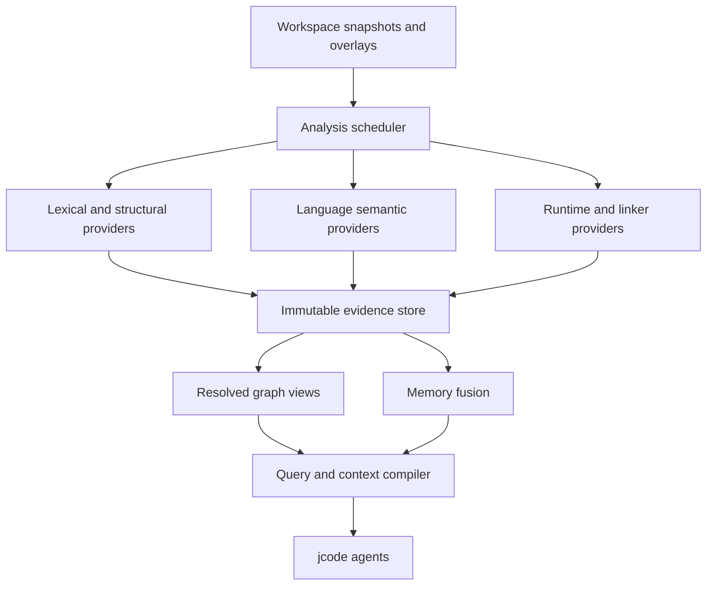

# jcode Code Intelligence Fabric

- **Design specification:** 2.0.0
- **Date:** 2026-08-16
- **Status:** Approved consolidated architecture; both feeder-audit amendment sets are integrated
- **Scope:** Native codebase intelligence for jcode, with a reference-grade Rust stack and extensible higher tiers for future languages

**Normative authority:** This document is the sole architectural source of truth. `2026-08-16-jcode-code-intelligence-fabric-implementation-plan.md` is its executable delivery plan. The two feeder audits are non-normative evidence and provenance records; where their proposal wording or terminology differs from this document, this document governs.

## 1. Executive summary

jcode will gain a native **Code Intelligence Fabric**: a language-neutral, evidence-oriented substrate whose first complete semantic stack is Rust. It will combine low-latency lexical search, structural indexing, stable semantic analysis, compiler-backed analysis, runtime evidence, linker evidence, verified transformations, context compilation, tool-use guidance, and proof-carrying memory.

The fabric is not a wrapper around a single external tool and not a collection of unrelated MCP servers. It is a cohesive jcode subsystem integrated at jcode's existing tool, context, storage-root, bus-notification, protocol, mutation-tool, and memory boundaries. The current checkout does not already provide the required intelligence SQLite actor, content-addressed evidence store, immutable analysis worlds, authoritative typed mutation log, or copy-on-write change transaction. Those are new intelligence-owned capabilities delivered by the implementation plan rather than assumed infrastructure.

Two architectural decisions govern the design:

1. **A2 — Language-neutral substrate with Rust semantic dominance.** Generic file, symbol, relation, evidence, query, context, and memory mechanisms are shared. Rust receives the first T2–T4 semantic stack. Future language stacks can add equivalent higher tiers without replacing the substrate.
2. **A3 — Unified evidence fabric with provider adapters.** Providers emit immutable facts into a native evidence model. Raw facts retain provenance; reproducible materialized views reconcile compatible evidence. Agents use one typed semantic/verification facade plus the retained AgentGrep compatibility surface.

The central correctness rule is:

> Evidence is immutable; resolved views are reproducible; certainty is never stronger than provider authority, scope, coverage, and freshness permit.

The central agent-operability rule is:

> jcode guarantees capability awareness and correctness gates; agents retain intelligent control over when, why, and how to use each capability.

The central memory rule is:

> The evidence store remembers what tools observed; memory records what those observations mean, with proof and validity conditions.

Version 2.0.0 consolidates both feeder audits and makes these correctness boundaries explicit:

1. Agent-visible capability claims are executable lifecycle records generated from the same registry that drives invocation.
2. Empty, incomplete, unavailable, failed, stale, and truncated results are distinct typed outcomes.
3. Negative conclusions require a query-addressable coverage and exclusion ledger for the exact claimed scope.
4. Context sufficiency is evaluated after evidence eligibility and token-budget projection, not inferred from fluent presentation or ranking.
5. Heuristic relations, routers, predictors, and rankers cannot become claim-bearing defaults without calibration and runtime enablement gates.
6. Exact search, unsafe screening, bounded model checking, deductive proof, and runtime observation are complementary evidence lanes, not a linear truth ladder.
7. Formal success requires an expected-work inventory, per-obligation outcomes, coverage and vacuity gates, and a complete trust ledger.
8. Proof repair freezes executable code, specifications, toolchain, and trust inputs; only authorized proof regions may change.
9. `agentgrep` remains the compatibility T0 surface while `code` is the single typed semantic and verification facade; neither raw provider tools nor raw `rg` become registered agent tools.
10. Evaluation baselines are recorded before a stage is enabled, and missing measurements fail closed rather than becoming skips.

### 1.1 Rejected alternatives

- **Rust-only substrate:** rejected because file discovery, lexical search, evidence storage, context budgeting, memory fusion, and agent capability discovery are not inherently Rust-specific. Making them Rust-only would force future languages to duplicate foundations.
- **Independent general-search sidecar:** rejected as the long-term boundary because it would add another workspace identity, cache, lifecycle, freshness, and truth-reconciliation boundary. Individual provider sidecars remain appropriate behind the fabric.
- **Federated broker over independent tool stores:** rejected because duplicate identities and indexes would make overlay consistency, provenance fusion, invalidation, and memory integration unnecessarily fragile.
- **One monolithic super-index:** rejected because rustc-private integrations and future language stacks would couple unstable semantics to the always-on daemon and central schema.

The selected A2/A3 combination retains one authoritative evidence and query boundary while allowing provider implementation and execution isolation.

### 1.2 Audit integration map

Every accepted feeder-audit amendment has a normative home in this specification:

| Amendment family | Normative sections |
|---|---|
| Executable capability truth, generated surfaces, parity, and calibration gates | 7, 8, 10, 17, 18, 19 |
| Typed dispositions, coverage/exclusion ledgers, blind spots, and trustworthy absence | 7, 9, 15, 17, 19 |
| Content-bound worlds, dirty overlays, tombstones, shrink guards, and overflow recovery | 6, 7, 8, 15, 17, 19 |
| Evidence eligibility, budget algebra, stable pagination, and post-budget sufficiency | 9, 11, 17, 18, 19 |
| Source-witnessed immutable memory, principal-first filtering, and revalidation | 12, 15, 17, 18, 19 |
| Patch preconditions, guarded change sessions, rollback, risk, and certificates | 13, 15, 17, 18, 19 |
| Search plans, lossless byte evidence, embedded ripgrep, and no-false-negative indexing | 7, 8, 9, 15, 17, 19 |
| Rust unsafe-screen obligations and calibrated approximation boundaries | 7, 8, 10, 17, 19 |
| Kani expected work, bounds, vacuity, trust, counterexamples, and playback | 7, 8, 10, 12, 13, 17, 19 |
| Verus obligations, dependency/trust graphs, proof profiles, records, and no-cheating | 7, 8, 10, 12, 13, 17, 19 |
| Guarded proof repair, semantic freeze, bounded escalation, and minimization | 8, 10, 12, 13, 17, 19 |
| Runtime, performance, Valgrind, and linker measurement certificates | 7, 8, 13, 16, 17, 19 |
| Fault injection, stage-before-baseline evaluation, and outcome release gates | 15, 16, 17, 18, 19 |

The audits remain the detailed source record for why each boundary exists. This map prevents an audit recommendation from becoming an untracked parallel requirement.

## 2. Goals

### 2.1 Primary goals

- Give agents unusually strong understanding of sophisticated Rust workspaces.
- Make navigation, impact analysis, refactoring, debugging, review, unsafe analysis, performance work, and linker investigation available through one coherent interface.
- Distinguish lexical candidates, structural inferences, stable semantic resolutions, compiler proofs, and runtime observations.
- Ensure every result is bound to the exact source snapshot, overlay, Cargo configuration, target, profile, generated inputs, and toolchain for which it is valid.
- Make tool capabilities discoverable and correctly usable by agents without requiring memorized documentation.
- Let agents autonomously choose tools according to task, uncertainty, risk, expected information gain, latency, and token budgets.
- Reuse prior results through evidence-aware memory without propagating stale or speculative conclusions.
- Reduce source-reading and tool-output token consumption through progressive disclosure and task-specific context compilation.
- Preserve jcode responsiveness and low baseline memory by keeping expensive compiler and runtime analyzers outside the always-on core.
- Establish stable provider contracts so future languages can acquire higher semantic tiers incrementally.

### 2.2 Success criteria

The design succeeds when agents demonstrably:

- Select appropriate tools for real Rust tasks and escalate only when necessary.
- Resolve symbols and relations more accurately than lexical or Tree-sitter-only harnesses.
- Produce correct patches more often, with fewer unnecessary file reads and tool calls.
- Avoid treating guesses, stale memory, incomplete analysis, or execution-specific observations as universal facts.
- Verify risky changes against an appropriate evidence tier before merge.
- Reuse current evidence and revalidate stale knowledge instead of repeatedly rediscovering the same facts.
- Continue basic navigation when deep providers are absent or fail.

### 2.3 Current jcode integration baseline

The current experimental checkout supplies reusable edges rather than the finished intelligence substrate: `Tool` and `ToolContext`, the tool registry and output context guard, AgentGrep modes and aliases, durable-state root helpers, volatile `FileTouch` bus notifications, protocol snapshots, direct filesystem mutation tools, persistent sessions, and the existing scoped memory graph. The implementation plan binds these exact edges through a versioned compatibility manifest.

The fabric adds a single-owner intelligence SQLite-WAL actor, filesystem CAS, immutable `AnalysisWorld` records, typed durable evidence events, provider leases, reproducible graph views, and guarded change sessions. These are authoritative only for intelligence state. They do not replace jcode's session store, memory owner, tool transport, configuration owner, or permission model.

Current mutation tools write files directly and `FileTouch` is advisory. Until every mutation path and external-edit reconciliation path passes parity and recovery gates, change sessions remain observe-only. Enforced preconditions and merge/completion gates are unavailable rather than simulated. The implementation plan must update its compatibility map whenever these repository boundaries change; path existence alone is not sufficient evidence of compatibility.

Enforcement scope is explicit. jcode can guarantee interception and rollback for registered mutation tools and jcode-owned isolated candidates; it cannot claim to prevent arbitrary external processes from writing the user's working tree. External changes invalidate permits, candidate worlds, and certificates through content reconciliation. A certificate binds the exact resulting snapshot and enforcement scope, never an ongoing claim that the mutable working tree cannot change afterward.

## 3. Non-goals

- A single monolithic analyzer containing every language and compiler integration.
- Treating Tree-sitter, substring matches, name matching, or graph proximity as compiler truth.
- Running all feature combinations, targets, profiles, or runtime paths automatically.
- Making embeddings mandatory for navigation or memory retrieval.
- Exposing provider-specific processes, caches, file formats, or MCP servers directly to agents.
- Automatically executing unbounded tool chains without agent or policy control.
- Storing raw agent chain-of-thought in memory or observability data.
- Replacing Cargo, rust-analyzer, rustc, linkers, profilers, or test runners.
- Allowing an analysis provider to mutate source files or the authoritative graph directly.

## 4. Design principles and invariants

1. **One semantic façade plus one compatibility search surface.** Provider implementation details stay behind the typed `code` operation facade. `agentgrep` remains the backward-compatible T0 search surface and shares normalized search contracts; it is not a second semantic API.
2. **Immutable worlds.** Every query and fact names an immutable analysis world.
3. **Proof-carrying claims.** Code-related conclusions retain evidence, scope, coverage, and freshness.
4. **No silent downgrade.** If requested authority is unavailable, jcode reports the downgrade or stops.
5. **Partial order of evidence.** Authority, scope, coverage, freshness, and confidence are separate dimensions.
6. **Absence is not proof by default.** Negative conclusions require declared complete coverage for the exact scope.
7. **Raw evidence is preserved.** Materialization never destroys disagreements or alternate derivations.
8. **Content-driven invalidation.** Timestamps may optimize checks but never establish correctness.
9. **Bounded work.** Queries and providers have explicit time, memory, node, edge, byte, and token budgets.
10. **Agents choose; policy guards.** Recommendations are advisory except for explicit correctness and safety gates.
11. **Memory is scoped.** Private hypotheses, overlay facts, runtime observations, and repository knowledge never collapse into one undifferentiated store.
12. **Expensive instability is isolated.** rustc-private, runtime, and linker providers are leased sidecars.
13. **Reproducibility before benchmark claims.** Performance and accuracy results name pinned corpora, worlds, providers, and hardware.
14. **Capability documentation is derived.** Agent preludes, detailed skills, MCP descriptions, examples, and fallback rules are generated from executable capability claims and conformance state.
15. **Empty is evidence-bearing.** An empty result is never accepted without a typed disposition, analyzed scope, exclusions, and silent-drop counters.
16. **Sufficiency follows budgeting.** A context packet is sufficient only if its task-specific proof obligations still pass after projection and truncation.
17. **Heuristics earn authority.** Calibration is measured per relation and construct; runtime gates disable unproven or regressed heuristics by default.

## 5. System topology

The fabric is divided into nine independently understandable components.

### 5.1 Workspace bridge

The workspace bridge subscribes to jcode repository, overlay, merge, manifest, toolchain, and artifact events. It converts mutable activity into immutable `AnalysisWorld` descriptors and emits fine-grained invalidation events. It never asks a provider to analyze an unspecified working directory.

### 5.2 Analysis scheduler

The scheduler plans provider work according to task urgency, analysis authority, world freshness, provider availability, and resource budgets. It deduplicates identical work across agents, coalesces rapid edits, cancels obsolete overlay work, and separates agent-blocking work from background enrichment.

### 5.3 Provider runtime

Providers implement a versioned typed protocol. Stable, cheap providers may run inside the daemon. Toolchain-pinned, experimental, untrusted, or resource-intensive providers run as capability-constrained sidecars. Providers emit facts; they do not update materialized views or agent memory directly.

### 5.4 Evidence ingestion and storage

Evidence batches are staged, validated, content-addressed, and atomically published. The intelligence subsystem's single-owner SQLite-WAL actor owns manifests, identities, lineage, job state, view epochs, capability claims, coverage and exclusion ledgers, and indexes under jcode's existing durable-state root. CAS owns complete provider artifacts and large payloads. The intelligence root and artifacts use platform-appropriate private permissions/ACLs, reject unsafe symlink/path traversal, and remain inaccessible to provider principals except through explicit preauthorized artifact handles. Compact read-optimized graph shards may be memory-mapped, but their authoritative identity remains registered in the intelligence store. This is not a second owner for sessions, user memory, configuration, or tool transport.

Every store read, write, materialization, cache lookup, evidence handle, and CAS expansion carries an `AccessContext` containing principal, repository, session/overlay ownership, and granted scope. Base evidence may be shared only among compatible authorized contexts; overlay/private evidence, counts, cache hits, and artifact existence cannot leak across principals. Access filtering occurs before materialization, aggregation, cache lookup, pagination, or error rendering.

`AccessContext` is derived from jcode's authenticated/local session and permission boundary, never from an agent-supplied request field or provider claim. Delegation uses explicit capability grants with scope and expiry; provider-native IDs cannot select another principal or overlay.

### 5.5 Identity resolver

The identity resolver connects provider-native symbols, syntax anchors, compiler identities, artifacts, and cross-snapshot lineage without collapsing ambiguous entities. It records identity assertions as evidence rather than relying on unqualified names.

### 5.6 Graph materializer

The materializer builds deterministic, immutable view epochs for individual analysis worlds. It deduplicates compatible facts, retains multiple sources, exposes conflicts, applies evidence reconciliation rules, and creates bounded adjacency indexes for agent queries.

### 5.7 Query and context compiler

The query layer implements the single agent-facing `code.*` façade. It compiles every request into a typed `QueryPlan` that separates traversal from projection and binds ordering, budgets, pagination, and world identity. The context compiler converts eligible graph and memory evidence into task-specific packets under explicit token budgets, then evaluates sufficiency again after projection. It preserves world identity, coverage, exclusions, blind spots, conflicts, truncation, omissions, and evidence handles.

### 5.8 Agent Capability Orchestrator

The orchestrator owns the executable capability registry. It publishes live capability cards, generates the minimal always-on agent prelude and detailed task skills, compiles task-relevant guidance, exposes dynamic provider availability, records compact local tool-decision records, and enforces only declared safety and completion gates. Generated agent surfaces are hash-tracked, installed idempotently, and checked for drift against the registry.

### 5.9 Memory fusion

Memory fusion converts selected evidence-backed interpretations into scoped memory capsules. It handles promotion, confirmation, contradiction, supersession, invalidation, revalidation, overlay isolation, and retrieval.

## 6. Analysis-world identity

An `AnalysisWorld` is the minimum reproducible unit for semantic claims. Its identifier is derived from:

- Repository identity and source snapshot.
- Per-agent overlay identity, if present.
- Workspace and Cargo package graph.
- Package, target, target triple, profile, feature set, and `cfg` values.
- Toolchain channel, compiler commit, standard library identity, and relevant components.
- Lockfile and resolved dependency identities.
- Relevant environment whitelist.
- Build-script inputs and captured outputs.
- Generated source identities.

Results from distinct worlds can coexist but cannot be merged as if equivalent. Cross-world queries explicitly request comparison.

jcode analyzes the active world automatically and may maintain user-configured critical worlds. It does not attempt the combinatorial set of every Cargo feature combination.

Provider identity, provider configuration, and sandbox trust mode belong to a separate `AnalysisRun` identity. This separation lets multiple providers analyze and contribute evidence to the same world without pretending they used the same method. When build-script or generated-source outputs are unavailable, the world records that unresolved input state and affected providers report reduced coverage rather than inventing an equivalent fully built world.

World identity is closed over the inputs a claim is permitted to depend on, not over an unknowable ambient machine. Providers start with a cleared environment and an explicit name-and-value whitelist, declared filesystem roots, network policy, tool binaries, and generated/build inputs. Sandbox-denied or dynamically discovered undeclared reads become dependency/coverage records and prevent reusable complete or negative claims. A provider that cannot enumerate or confine relevant inputs marks the affected result `partial` or `unsupported`; it cannot reuse a cache key as if the world were closed.

## 7. Evidence model

### 7.1 Core records

| Record | Required meaning |
|---|---|
| `Entity` | File, module, symbol, type, implementation, artifact, diagnostic, test, runtime region, or provider extension entity |
| `Fact` | A typed subject–relation–object assertion, property, location, diagnostic, or observation |
| `EvidenceBatch` | Atomic provider publication for one world and declared coverage shard |
| `AnalysisRun` | Provider, version, configuration, trust mode, resource policy, and execution identity for one analysis attempt |
| `Derivation` | Provider, version, method, configuration, input hashes, source sites, and parent evidence |
| `Coverage` | The files, targets, constructs, phases, and scopes successfully analyzed |
| `BlindSpot` | Unsupported, failed, skipped, ambiguous, truncated, sandbox-denied, or unavailable regions |
| `ViewEpoch` | Deterministic materialization over a specified set of evidence batches |
| `Lineage` | Evidence-backed relation between entities across snapshots or worlds |
| `ChangeRiskAssessment` | Structured classification of change scope, hazards, evidence gaps, and required verification |
| `CapabilityClaim` | Executable maturity, conformance, calibration, availability, and health claim for one agent-visible capability and version |
| `ResultDisposition` | Typed interpretation of whether a result is complete, empty, partial, unsupported, unavailable, failed, stale, cancelled, or truncated |
| `CoverageLedger` | Attempted, completed, omitted, unsupported, and silently dropped analysis units for an exact provider/query scope |
| `ExclusionRecord` | Suppression, waiver, ignore, equivalence, annotation, or budget exclusion with origin and validity |
| `SourceWitness` | Resolvable source/artifact identity, digest, location, lineage, and access scope supporting a fact or memory claim |
| `BlindSpotAction` | Machine-actionable safe next step for an incomplete or ambiguous result |
| `QueryPlan` | Compiled relation, traversal, projection, boundary, budget, ordering, and pagination contract |
| `PacketAssessment` | Post-budget task-specific eligibility, sufficiency, omissions, unsafe claims, and follow-up obligations |
| `PatchPrecondition` | Content, file identity, range, encoding, policy, scope, and symlink conditions required before an edit may commit |
| `VerificationCertificate` | World-bound performance, runtime, linker, or change result with method, coverage, perturbation, exclusions, and raw artifacts |
| `ClaimClosure` | Independently derived universe of subjects, behaviors, callers, harnesses, obligations, and specification gaps required for a requested claim |
| `SpecificationAdequacyAssessment` | Whether the supplied or modeled specification is strong and complete enough for the requested claim, with omissions and unsafe-to-generalize reasons |

Every fact has polarity (`asserted`, `refuted`, or `unknown`), world scope, provider authority, derivation, coverage reference, and freshness inputs.

### 7.2 Result disposition

Every provider shard and query projection carries exactly one terminal disposition:

| Disposition | Meaning |
|---|---|
| `complete_nonempty` | The declared scope completed and produced results |
| `complete_empty` | The declared scope completed, produced no results, and has a coverage ledger sufficient to interpret absence |
| `partial` | Some declared units completed and some did not |
| `unsupported` | The provider cannot analyze the requested language, construct, world, target, or mode |
| `unavailable` | A normally supported capability is not currently usable because a prerequisite or healthy provider is missing |
| `not_executed` | A runtime/artifact check was compiled or requested but did not actually run in the claimed mode |
| `failed` | The provider returned a typed operational or input failure |
| `timed_out` | A declared time or solver budget expired |
| `crashed` | The provider terminated abnormally or violated its protocol |
| `stale` | The result exists but no longer matches the active or requested world |
| `cancelled` | Work ended because its lease or request was cancelled |
| `truncated` | The underlying result may be usable, but the returned projection omitted units because of an output budget |

`complete_empty` is not inferred from an empty collection. It is valid only when provider completion, relevant coverage, exclusions, parser disposition, and silent-drop counters support the absence claim. No-op instrumentation, native execution outside the requested runtime tool, swallowed provider errors, and stub implementations cannot yield a successful disposition.

Method-specific outcomes such as `proved`, `disproved`, `unknown`, `unreachable`, `incomplete`, and `resource_exhausted` live in typed payloads and do not create competing envelope dispositions. Incomplete expected work yields envelope `partial`; an operation that never ran yields `not_executed`; timeout, crash, cancellation, and failure remain explicit even when some completed unit results are retained.

### 7.3 Coverage and exclusions

A `CoverageLedger` is addressable evidence rather than a prose summary. It records, as applicable:

- Attempted and completed files, packages, targets, functions, MIR bodies, graph nodes and edges, input sections and bytes, tests, runtime intervals, artifacts, and feature worlds.
- Parser and indexing dispositions per file, including unreadable, unstable, oversized, invalid encoding, unsupported dialect, syntax failure, provider failure, and legacy-unknown states.
- Unsupported syntax, macros, build outputs, indirect calls, dynamic dispatch, function pointers, solver bounds, traversal caps, hub suppression, queue drops, and watcher overflow.
- Evidence completeness separately from analysis completeness.
- Every `ExclusionRecord`, including ignored fields, suppressions, accepted equivalence rules, annotations, waivers, origin or approver, expiry, and affected scope.
- Silent-drop counters and shape-check counters even when their value is zero.

External surfaces progress through `observed`, `identified`, `modeled`, `monitored`, `bound`, and `repair_eligible`; a later state cannot be inferred from an earlier one. Claims such as no callers, no path, no vulnerability applicability, no runtime error, or no linker difference are legal only when the relevant ledger scope is complete after exclusions.

### 7.4 Identity

- Files use repository-relative normalized paths within a snapshot; content equality does not make two paths the same file.
- Every followed symlink records both link identity and resolved target identity. Search may follow only targets inside explicitly granted roots unless a separate external-root grant exists; loops, hardlink aliases, replacement races, and filesystem boundary changes are typed dispositions, never silently normalized away.
- Rust definitions prefer compiler or official SCIP identities such as `DefPathHash` or canonical SCIP symbols when available. These identities remain provider-, compiler-, and world-scoped unless separate lineage evidence establishes continuity.
- Structural providers use language, qualified scope, syntax kind, source anchors, and syntax fingerprints.
- Occurrences use world, file identity, byte range, syntax role, and provider derivation.
- Local variables and anonymous constructs remain world-local unless reliable lineage is established.
- Rename, move, split, and merge lineage are relations with evidence and confidence, not destructive ID rewrites.

### 7.5 Evidence dimensions

Evidence is not represented by one universal confidence number. The materializer and agents consider:

- **Authority:** lexical candidate, parsed structure, stable semantic resolution, compiler proof.
- **Scope:** repository, workspace, crate, build world, artifact, test, or execution.
- **Coverage:** complete for declared scope, bounded, sampled, partial, or unknown.
- **Freshness:** current, reusable, stale, invalid, or unavailable.
- **Confidence:** provider- and relation-calibrated probability or categorical certainty.

Runtime observation is scoped evidence, not a universally stronger semantic fact. An observed call proves that the path occurred in one execution; it does not prove that other paths are impossible.

### 7.6 Reconciliation

The materializer follows these rules:

1. Exact compatible facts are deduplicated while retaining all derivations.
2. Compiler-backed relations may supersede weaker relations only within compatible world and scope.
3. Lexical candidates remain candidates even when useful for ranking.
4. Runtime and linker observations enrich semantic relations rather than replacing them.
5. Contradictory provider results remain explicit.
6. Negative evidence is usable only when its provider declares sufficient completeness.
7. Ambiguous identity links do not collapse entities.
8. Truncated traversal is never represented as a complete result.
9. Heuristic evidence cannot satisfy a claim while its calibration gate is disabled.
10. A diagnostic, recommendation, or fluent summary cannot substitute for the evidence family required by a task-specific claim.

### 7.7 Invalidation and dirty overlays

Evidence batches carry dependency manifests. Source content, manifest, dependency, generated input, toolchain, provider, configuration, sandbox policy, binary, or test changes invalidate only evidence that names those dependencies. Mtime may avoid unnecessary hashing only when a stronger identity mechanism confirms correctness; it is never the sole invalidation authority.

Incremental analysis uses an immutable base plus a world-local dirty overlay. The overlay owns tombstones for deleted/replaced entities, endpoint redirects, origin labels, and relation-family masks so it hides only relation families actually rebuilt by the changed provider. Each analyzed file carries its content digest and extraction disposition. Unreadable files may retain their previous evidence only as explicitly stale, are removed from the fresh inventory, and must be retried. Parse failure cannot authorize silent per-file graph shrink, and watcher overflow triggers a full content reconciliation before freshness is restored.

## 8. Provider model

### 8.1 Provider contract

Every provider implements typed operations for:

- Manifest and capability negotiation.
- Version and schema compatibility.
- Work planning and cost estimation.
- Analysis-world validation.
- Streaming staged evidence shards.
- Coverage and blind-spot reporting.
- Cancellation, health, progress, and graceful shutdown.
- Cache identity declaration.
- Executable self-test and surface-conformance inventory.
- Per-file or per-unit extraction disposition and silent-drop accounting.

Provider-specific facts use namespaced typed extensions. Unknown extensions can be retained even when a materializer version cannot interpret them.

Providers may maintain performance caches, but jcode owns authoritative cache registration and evidence identity. A hidden provider cache cannot become a second source of truth.

Providers that require a toolchain incompatible with jcode's main workspace, especially rustc-private/Dylint drivers, use a separate build root, lockfile, and pinned toolchain while depending on stable shared wire/types crates through reviewed path or published interfaces. They are excluded from the root stable-toolchain workspace matrix and run their own equally mandatory format, build, test, conformance, provenance, and vulnerability gates. Process isolation without build-graph isolation is insufficient.

Provider cache identity must classify inputs rather than flatten them into path strings. At minimum it includes provider binary and schema, toolchain, ordered active analysis or lint set, configuration value digest, environment-value digest, Cargo world, scope policy, trust mode, fix mode, and declared path dependencies. File dependencies, configuration values, environment values, binaries, and ordered capability sets remain distinct dependency categories.

A provider must prove parity across every surface it advertises: native API, CLI, MCP, generated skill, and agent card. These surfaces share one operation implementation and a golden conformance corpus. A command that exists only as a stub, returns default empty vectors, swallows best-effort errors, or disagrees with another surface remains `declared` or `implemented` under experimental policy; it cannot become `available`.

### 8.2 Rust evidence tiers

| Tier | Purpose | Representative providers |
|---|---|---|
| T0 | Fast candidates and source access | Embedded ripgrep-grade direct search, policy-compatible no-false-negative candidate index, token-bounded reader |
| T1 | Parsed structure and provisional graph | Tree-sitter Rust outlines, modules, imports, syntax errors, structural blind spots |
| T2 | Stable semantics | Cargo metadata and diagnostics, persistent rust-analyzer integration, official SCIP ingestion |
| T3 | Compiler and formal analysis | Sibling lanes: pinned Dylint/rustc/Rudra-derived screening, RAPx-derived HIR/THIR/MIR analysis, Kani bounded verification, Verus deductive verification |
| T4 | Observed and artifact evidence | Kani counterexample playback, Hotpath, Wild link evidence, Valgrind/Crabgrind, selected tests and benchmarks |

T0/T1 remain warm and incremental. T2 remains persistent for active repositories when budgets allow. T3 is request-, risk-, or audit-driven. T4 is explicitly scoped to selected artifacts and executions.

T3 unsafe screening emits `UnsafePatternFinding` records containing detector, source/sink witnesses, MIR path, severity, calibrated confidence, approximations, interprocedural boundary, coverage, and escalation options. A screen reports triage evidence and cannot emit `proved` or turn no findings into safety. Deeper compiler/formal unsafe analyses emit `RustUnsafeObligation` records containing obligation kind, HIR/MIR identity and location, provenance, aliases, path conditions, required property, unsupported operations, loop/inline/solver budgets, completeness, result, witness or counterexample, and target world. Valid obligation outcomes are `proved`, `disproved`, `unknown`, `unsupported`, `timed_out`, `crashed`, and `incomplete`. Opaque calls, missing checkpoints, panics, empty path sets, unresolved dynamic dispatch, or solver construction failures can never yield `proved`. The two record families share subject/world/coverage identity but are never silently converted into each other.

T3 has sibling methods rather than ordered subtiers. A calibrated unsafe screen reports patterns and approximation boundaries but cannot prove safety by finding nothing. Kani proves or disproves properties only for an explicit harness, domain, bound, configuration, and trust set. Verus proves obligations only relative to explicit specifications, dependencies, solver configuration, disabled checks, macros, and trusted assumptions. A `FormalVerificationContract` declares expected harnesses, proof buckets, functions, properties, reachability, bounds, trust inputs, and required outcomes before execution. A successful aggregate result requires one terminal bucket for every expected unit plus a passing `VacuityAndCoverageGate`.

Expected work is not authored solely by the request or provider being evaluated. A separate claim-closure pass derives required subjects, affected callers, behaviors, harnesses, obligations, partitions, and specification gaps from the T2 graph, change risk, source annotations, provider inventory, and task claim. `SpecificationAdequacyAssessment` can return `adequate`, `partial`, or `unsafe_to_generalize`; a proof of a narrower or incomplete specification remains valid only for that explicit specification and cannot satisfy the broader claim.

Every formal claim uses a jcode-owned `ProofObligation` identity created before provider translation and including full generic substitutions, trait instance, source/specification witnesses, normalized formula digest, and world. A query-addressable `TrustLedger` records assumptions, stubs, external bodies/specifications, imported metadata, macro producer and expansion identity, toolchain/solver binaries, disabled checks, and known model limitations. A `ProofDependencyGraph` makes invalidation and explanation transitive. Counterexamples retain symbolic assignments, traces, bounds, model limits, and reproducible invocation; optional T4 playback is corroboration, not a prerequisite for accepting a complete symbolic counterexample.

The launcher independently resolves and hashes every compiler, verifier, CBMC backend, SMT solver, runtime tool, macro producer, and relevant support artifact before execution and compares it with the reviewed toolchain/supply-chain manifest. Provider-reported version strings or self-attestation alone cannot establish a claim-bearing trust identity.

Proof repair is a guarded change workflow. It freezes executable source, specifications, trusted dependencies, provider/toolchain/solver identity, and allowed proof-edit regions. Attempts that change frozen semantics, add forbidden trust constructs, exceed the finite resource-escalation schedule, or cannot pass the semantic cheat checker are rejected. Successful proof-only edits are minimized and reverified from the frozen baseline before certification.

T4 providers emit certificates, not bare prose. Performance instrumentation declares exact measured region, allocator, session lifecycle, warmup, cardinality and retention budgets, sampling coverage, and whether it can perturb scheduling, backpressure, allocation, or I/O. Link analysis declares captured arguments and inputs, symbol resolution, section retention and GC, relocation and output checks, reference-linker comparisons, covered bytes/sections, accepted equivalences, ignored fields, behavior smoke tests, and support-matrix cells. Valgrind-style checks declare the active tool, whether execution actually occurred under it, versions, target, suppressions, annotations, before/after error counts, and raw artifacts.

An interchange format does not determine evidence authority. SCIP evidence inherits the authority, version, configuration, and coverage of the index producer; merely parsing official SCIP protobuf does not promote an index to compiler proof. Likewise, a T3 provider is compiler-integrated, but each emitted conclusion still declares its analysis method and strength.

The T0–T4 labels are routing and cost families, not a total truth ordering. In particular, a T4 runtime observation does not generally dominate T3 semantic evidence; they answer different scoped questions and are reconciled through the multidimensional evidence model.

### 8.3 Scheduling

Scheduling priority is:

1. Agent-blocking queries.
2. Active-overlay validation.
3. Merge verification.
4. Background semantic refresh.
5. Speculative indexing, profiling, and nonessential enrichment.

Jobs are keyed by access-compatible world/visibility scope, provider, version, full cache-input identity, trust mode, and coverage shard. Equivalent base-world jobs are shared only when principals are authorized for the same inputs and outputs; overlay/private jobs, progress, errors, counts, and artifacts remain isolated. Longer operations publish progress within 100 ms and remain cancellable.

One scheduler owns admission for each expensive shared resource. Providers cannot create a competing top-level scheduler. Admission uses typed bounded queues, shared worker budgets, cancellation, retry policy, watchdogs, and explicit backpressure. Nested parallel work consumes the same budget. Busy polling, unbounded channels, and unbounded fixed-order reorder buffers are forbidden in provider integrations.

## 9. Agent-facing API

Agents use a small set of native typed operations:

| Operation | Responsibility |
|---|---|
| `code.map` | Workspace, package, module, subsystem, and change orientation |
| `code.find` | Ranked lexical, structural, and semantic search |
| `code.inspect` | Definition, type, implementations, diagnostics, source, and evidence |
| `code.relations` | References, callers, callees, imports, implementations, ownership, and extension relations |
| `code.impact` | Bounded forward/reverse change impact with coverage and risk |
| `code.context` | Task-specific token-budgeted context packet |
| `code.change_plan` | Non-mutating transformation plan |
| `code.verify_change` | Before/after semantic and behavioral verification |
| `code.capabilities` | Live discovery and expansion of available analysis capabilities |
| `code.verify_plan` | Select compiler, formal, runtime, and linker lanes for an explicit claim |
| `code.verify_unsafe_screen` | Run calibrated MIR-based unsafe-risk triage |
| `code.verify_kani` | Run bounded model checking with expected-work and vacuity gates |
| `code.verify_verus` | Run deductive verification with obligation, dependency, and trust accounting |
| `code.prove_repair` | Run an authorized proof-only repair session against frozen semantics |
| `code.counterexample_materialize` | Materialize supported symbolic counterexamples as scoped regression tests |
| `code.verify_explain` | Explain proof, failure, unknown, assumption, exclusion, cost, or blind spot |
| `code.lint` | Run selected compiler-integrated lints under a pinned provider contract |
| `code.mir_explain` | Explain bounded HIR/THIR/MIR evidence and unsupported regions |
| `code.profile` | Produce scoped performance/runtime evidence under a measurement contract |
| `code.link_explain` | Produce scoped linker and artifact evidence with reproduction and comparison coverage |

The registered tool name is `code`. The table's dotted notation is documentation shorthand for closed snake-case `operation` values such as `find`, `verify_kani`, and `link_explain`; there are no separately registered `code.find` or provider-specific tools. Capability identifiers may be namespaced, for example `rust.verify_kani`, but map to the same closed operation implementation. `agentgrep` remains the separately registered compatibility T0 tool. Raw `rg`, Kani, Verus, rustc drivers, and provider executables are never registered agent tools. Deep capabilities are not assumed to be installed or healthy.

There is no free-form `code.run` dispatcher that hides operation semantics behind prose. Each agent-visible operation retains a constrained native schema even when jcode exposes only a task-relevant subset to a particular model turn.

Every graph-bearing operation compiles into a `QueryPlan` before execution. The plan contains access context and principal; seed identities and disambiguation state; direction and relation set; edge contexts; crate, package, target, and world boundaries; traversal predicates distinct from projection predicates; depth, node, edge, byte, token, time, and hub-expansion bounds; stable ordering; batch subqueries; and world-bound pagination. The normalized plan is returned in compact form so an agent can tell what was searched without reading provider traces.

Batch queries are native rather than repeated single-item wrappers. A bounded traversal may retain a hub as a result without expanding it. Automatic hub suppression, hidden heuristic candidates, lower-bound semantics, and unresolved seed ambiguity are reported as structured plan decisions.

### 9.1 Response contract

Every query response includes:

- Request ID, analysis-world ID, and view epoch.
- `ResultDisposition`, status, authority summary, and whether an empty result is claim-bearing.
- Structured entities, relations, diagnostics, or change results.
- Evidence handles and derivation summary.
- Coverage-ledger and exclusion handles, analyzed and omitted units, parser completeness, and blind spots.
- Silent-drop counters and shape-check counters.
- Conflicts and ambiguities.
- Freshness.
- Whether the queried world is still the active workspace world.
- Stable ordering, total when knowable, offset or cursor position, `has_more`, truncation status, and an exact world-bound continuation.
- Bounded `BlindSpotAction` recommendations with machine-readable reason codes.

Continuation tokens bind the normalized query, world, view epoch, ordering, budget, expiry, and principal. They are authenticated with a cryptographically random installation-local key owned by the intelligence store and protected by platform-appropriate file permissions/ACLs; the key never enters SQLite, CAS, logs, metrics, or exported artifacts. Tokens include a non-secret key identifier, never key material. Rotation invalidates old tokens explicitly, comparison is constant-time, and incompatible world/view/principal/expiry changes fail closed.

## 10. Capability awareness and guided autonomy

### 10.1 Live capability cards

Each operation publishes a compact card containing purpose, supported languages, when to use it, when not to use it, authority, prerequisites, expected cost and latency, side effects, schema, failure behavior, and a small correct-use example.

Agents always receive a concise index of capability groups. Before each model turn, jcode exposes detailed cards for tools relevant to the task, language, files, evidence gaps, and provider health. An agent can expand the catalog with `code.capabilities`.

The registry is executable truth rather than hand-maintained documentation. Each `CapabilityClaim` progresses through `declared`, `implemented`, `conformant`, `calibrated`, `available`, and `verified`. The claim binds operation schema, provider/version, supported worlds and constructs, authority, cost model, conformance suite, calibration identity, known blind spots, and live health. Operational state (`healthy`, `degraded`, `unavailable`, or `quarantined`) is evaluated separately from maturity so a verified capability can still be temporarily unavailable.

jcode generates four synchronized surfaces from this registry:

1. A minimal always-on prelude that announces the native `code.*` façade and how to discover deeper capabilities.
2. Task- and language-specific detailed skills with triggers, selection rules, fallbacks, examples, and verification duties.
3. Native/MCP/CLI descriptions and schemas.
4. Capability-card and failure-recovery documentation.

Generation has golden snapshots and CI drift checks. Installation is idempotent, records version and content hashes, preserves foreign hooks and user-owned text, refreshes stale unedited generated blocks, and refuses to overwrite modified blocks silently. A generated surface cannot advertise a maturity or behavior absent from the executable claim.

### 10.2 Three control levels

1. **Discovery is automatic.** jcode ensures the agent knows the tool exists and whether it is currently usable.
2. **Recommendations are advisory.** jcode may suggest tools, but the agent chooses, reorders, skips, or adds operations.
3. **Correctness gates are selective.** Only declared safety or completion invariants are enforced.

Nonblocking pre-tool nudges may point an agent from raw grep/read/edit toward a more suitable capability when a live graph or verifier exists. Nudges fail open, never conceal the requested tool, carry a reason code, and are evaluated for useful redirection versus interruption.

### 10.3 Situation-aware tool choice

Agents select tools using the user objective, evidence gaps, ambiguity, risk, required certainty, freshness, coverage, expected information gain, latency, token budget, and whether new evidence could change the action.

The default escalation rule is:

> Use the cheapest evidence capable of answering reliably; escalate when uncertainty, risk, conflict, or missing coverage makes it insufficient.

Playbooks are decision templates with possible tools, escalation triggers, sufficiency criteria, fallback actions, and a small set of non-negotiable gates. They are not fixed scripts. Every suggested or selected tool records a compact reason code such as `cheap_sufficient`, `semantic_ambiguity`, `coverage_gap`, `high_change_risk`, `stale_evidence`, `provider_unavailable`, `calibration_disabled`, or `verification_required`.

Examples include semantic edit, public API change, unsafe change, dependency change, performance optimization, and multi-file refactoring. A compact `ToolDecision` record captures the evidence gap, chosen operation, expected value, and cost without storing hidden reasoning.

### 10.4 Agent-operability evaluation

Tool descriptions and guidance are tested across supported models for discovery rate, correct first-tool choice, redundant calls, appropriate evidence escalation, stale-result handling, response-disposition interpretation, verification completion, token cost, latency, and task success. Golden tests also assert native/CLI/MCP/generated-skill parity and that unavailable, uncalibrated, or stub capabilities are not recommended as usable.

## 11. Context compiler and token economy

`code.context` accepts modes such as orientation, implementation, debugging, refactoring, review, security, and performance. It builds a packet containing:

- Task and analysis-world header.
- Evidence authority, freshness, and coverage summary.
- Ranked entities and minimal source spans.
- Relevant relations, implementations, tests, diagnostics, and invariants.
- Change hazards and unresolved questions.
- Conflicts, blind spots, and truncation.
- Evidence and memory handles for selective expansion.

Each mode is an executable `ContextModeContract`, not a prose label:

| Mode | Minimum claim families before `sufficient` |
|---|---|
| orientation | World/package/module identity, subsystem diversity, entry points, and declared unknown regions |
| implementation | Resolved target, definition/type, implementations, direct relations, invariants, tests, and edit hazards |
| debugging | Symptom/diagnostic evidence, candidate path and state transitions, relevant tests/runtime scope, conflicts, and falsifying checks |
| refactoring | Exact targets, complete-enough references/implementations for the declared scope, impact/risk, public API, tests, and unresolved sites |
| review | Changed entities, dependency/behavior impact, diagnostics/tests, risk dimensions, omissions, and negative controls appropriate to the claim |
| security | Trust boundary, source-to-sink or obligation path, unsafe/dependency/configuration evidence, threat assumptions, coverage, and explicit nonclaims |
| performance | Baseline/measurement scope, call/resource evidence, hardware/build identity, perturbation, comparison policy, and statistical limits |
| proof | Claim closure, specification adequacy, obligations, dependency/trust graph, bounds/coverage/vacuity, outcomes, and counterexamples |

Exact-path and ordered-flow obligations remain additional requirements in every applicable mode. The registry versions these contracts and the evaluation corpus tests each required family and negative control.

Candidate ranking and evidence eligibility are separate passes. Lexical candidates, heuristics, embeddings, and synthetic summaries may improve ranking, but only evidence families allowed by the task mode may support a claim. Diagnostics and recommendations cannot promote an unrelated claim. Each exact requested path requires its own proof-bearing claim; ordered-flow tasks require resolved endpoints, intermediate roles, transitions, and declared gaps.

Each packet uses an explicit budget algebra: reserve space for the world/authority header, reserve a correctness footer, allocate the remaining evidence budget by task mode and subsystem diversity, and retain a small continuation reserve. Projection cascades from minimal source spans to outlines, signatures, and finally declared truncation. The correctness footer, disposition, omissions, blind spots, and continuation are never removed to fit more source. Strict modes produce a stable prefix of larger budgets where feasible, while still reporting when diversity or orientation requirements prevent exact prefix stability.

After budgeting, a task-specific `PacketAssessment` reruns sufficiency checks over the materialized packet. Each mode defines required claim families, exact-path obligations, flow roles, negative controls, citation coverage, subsystem diversity, and maximum unresolved risk. Outcomes include `sufficient`, `partial`, and `unsafe_to_claim`, with gaps and targeted follow-up operations. A fluent packet, high ranking score, or provider assertion cannot set `sufficient` without this evaluator.

Token savings come from progressive disclosure, common-path dictionaries, stable compact entity references, deduplicated source spans, ranked graph expansion, native batches, reuse of current-world evidence, and hard output budgets. Compression may shorten representation but cannot remove supporting spans, uncertainty, conflicting evidence, missing coverage, omissions, or truncation from a claim-bearing packet. Compressed source without preserved evidence spans is orientation-only.

Default `code.map` responses target 500–1,000 tokens. Other packets honor an explicit hard budget and provide exact continuation when useful. Pagination and repeated calls remain deterministic for the same world, view, query, and budget. Token efficiency is evaluated as correct task completion per token, not compression ratio alone.

## 12. Memory fusion

### 12.1 Separation of responsibilities

- The evidence store retains exact provider observations and their derivations.
- Query caches retain reproducible results for exact worlds and view epochs.
- Working memory retains task-local findings and hypotheses.
- Durable memory retains selected interpretations, decisions, and verified change history.

Raw tool output is stored once in CAS and referenced; it is not copied wholesale into long-term memory.

Before prompt projection, memory promotion, logging, protocol rendering, or export, artifacts pass bounded secret-like-content and sensitivity classification. Authoritative raw evidence is never silently rewritten; sensitive raw artifacts remain private/local with restricted expansion and a separately generated redacted projection where safe. Retention and export are per artifact class. Deletion is best-effort logical removal and unlink/key destruction where applicable, not a false promise of physical erasure from SSDs, snapshots, or backups.

### 12.2 Memory scopes

| Scope | Meaning | Default visibility |
|---|---|---|
| Working observation | Recent results, inspected entities, unresolved hypotheses | Current agent/task |
| Task conclusion | Confirmed findings and outstanding risks | Collaborating task agents |
| Overlay knowledge | Facts about one agent's unmerged changes | Owning agent |
| Repository knowledge | Validated architecture, invariants, and semantic conclusions | Repository agents |
| Project decision | User-approved constraints and choices | Durable project scope |
| Change certificate | Verified before/after effect of a merged change | Durable audit scope |

### 12.3 Memory capsule

A code-related `MemoryCapsule` contains subject, normalized claim, entity links, world scope, evidence handles, provider authority, coverage, blind spots, validation state, validity dependencies, creator, timestamp, visibility, contradiction/supersession links, stable idempotency identity, and a concise summary. Every code-bearing capsule includes one or more `SourceWitness` records naming the source or artifact identity, digest, exact location or symbol anchor, compatible lineage rules, and access scope.

The summary is a regenerable projection. Evidence remains authoritative.

Memory observations are immutable. Corrections create new observations linked by `supersedes`; they do not rewrite history. Repeating the same idempotency key with the same canonical content is a no-op, while the same key with different content is rejected as an integrity conflict. Provider sidecars and ordinary read/query capabilities cannot write durable memory; promotion requires a separate memory-write capability held by the jcode memory owner.

### 12.4 Promotion and fusion

After a tool call:

1. The exact structured result enters CAS and the event log.
2. Provider facts enter the evidence fabric.
3. Memory fusion links facts to entities and existing capsules.
4. Results are classified as confirming, enriching, contradicting, superseding, or unrelated.
5. Policy selects working memory or a durable memory candidate.
6. Validated candidates are published to the correct scope.
7. Conflicts remain visible.

Before high-trust promotion, every `SourceWitness` must resolve in the intended repository or artifact lineage, match its digest or a declared compatible successor, and be visible to the destination principal. An unresolved, mismatched, inaccessible, or stale witness keeps the memory tentative or stale even when the summary sounds correct.

T0 candidates remain temporary. T1 conclusions are normally tentative. T2/T3 conclusions may become validated but remain world-bound. T4 observations remain artifact- and execution-bound. User decisions and successful change certificates are durable. Agent hypotheses require supporting evidence before shared promotion.

### 12.5 Lifecycle and retrieval

Memory states are `legacy_unproven`, `tentative`, `validated`, `stale`, `revalidated`, `contradicted`, `superseded`, and `retired`. Migrated legacy entries without evidence capsules are `legacy_unproven`: they may appear only as clearly labeled historical orientation and cannot satisfy context sufficiency, negative claims, verification, routing authority, or durable code conclusions. Invalidation marks memory stale rather than deleting history. Revalidation produces a linked evidence-backed version; it never upgrades the legacy record in place.

Retrieval first filters principal access, repository, world compatibility, overlay visibility, validation state, source-witness validity, and validity conditions. Principal and overlay filters run before counts, supersession resolution, ranking, aggregation, or rendering so inaccessible memories cannot influence even summary statistics. It then ranks entity links, relation relevance, task similarity, recency, and evidence quality. Embeddings are optional secondary signals after hard filters.

Overlay memory cannot silently become base knowledge. After merge, entity lineage and the final change certificate determine which capsules may be promoted to the new repository snapshot.

The Capability Orchestrator consults recent evidence and query history so agents can reuse current results, avoid redundant calls, and identify the remaining evidence gap.

Negative memories, procedural guidance, user-approved project decisions, runtime observations, and semantic claims remain distinct types with independent promotion and expiry rules. A negative memory cannot be promoted from absence unless its original coverage ledger remains valid for the retrieved world.

## 13. Verified change workflow

1. Freeze the baseline analysis world.
2. Resolve the intended semantic target.
3. Compute bounded impact and a `ChangeRiskAssessment` from affected entities, API surface, unsafe code, concurrency, dependencies, build configuration, artifacts, coverage, and blind spots.
4. Produce a non-mutating plan classifying automatic, review-required, and unresolved sites, with evidence and reason for each classification.
5. Build `PatchPrecondition` records for every file and validate all multi-file preconditions before mutating any authoritative overlay state.
6. Apply approved edits through the intelligence `ChangeSession` transaction once enforcement readiness is proven; before that point, observe direct mutations and use isolated disposable worktree variants for speculative candidates.
7. Refresh T0/T1 evidence incrementally.
8. Re-run T2 semantic analysis.
9. Invoke T3/T4 according to risk and required claims.
10. Compare semantic graph, diagnostics, public API, unsafe behavior, tests, profiles, and artifacts as applicable.
11. Emit a `ChangeCertificate`.
12. Permit certified completion or transactional merge only when the relevant enforcement capability is available and declared policy requirements pass; otherwise report observe-only status explicitly.

The intelligence fabric assists and verifies edits but does not bypass jcode's workspace and merge authority.

The agent may propose or challenge a risk classification, but jcode's policy engine validates it against structured graph and change evidence. The assessment determines minimum semantic tiers, tests, build worlds, runtime checks, approvals, and certificate fields. A missing or ambiguous assessment cannot silently default to low risk.

Observe-only change sessions may emit diagnostic or investigation certificates describing what was observed and verified, but they cannot certify atomic interception, stale-write prevention, rollback completeness, or authorize an enforcement-backed completion claim. Such a certificate declares its mode and residual gap. Completion authorization requiring those properties is unavailable until enforced `ChangeSession` readiness passes.

### 13.1 Patch preconditions and structural verification

Every proposed edit binds the original content digest, file identity, encoding, expected ranges or anchors, symlink policy, and target world. Patch policy also enforces graph-derived allowed scope plus explained expansions, file and changed-line limits, protected/generated/dependency/binary/secret-like file rules, repository-relative safe paths, and path-escape prevention. Text offsets computed from one digest cannot be applied to reopened content with another digest.

Mutation paths use descriptor/handle-relative no-follow opens where supported, bind device/inode or platform file identity in addition to content, reject unexpected hardlinks and reparse/symlink replacement, and revalidate the opened handle immediately before replacement. Platforms unable to enforce the declared file-identity policy keep guarded enforcement unavailable.

For a multi-file change, all preconditions pass before any file is committed in enforced mode. The guarded commit uses descriptor-bound same-directory staging, a durable write-ahead journal, per-path compare-and-swap identity checks, permission preservation, required fsync ordering, rollback artifacts, and startup recovery. Multiple filesystem paths are not globally atomically visible; the contract is recoverable guarded commit with explicit `RollbackRequired` on unresolved crash/race divergence. Observe-only mode records violations and invalidates worlds but never claims atomic enforcement.

For the strongest mode, edits execute in a jcode-owned isolated worktree candidate. Promotion validates every base digest and policy precondition again, applies through the registered transaction, performs a final full content reconciliation, and binds the certificate to the resulting snapshot. Any unaccounted external write before certification rejects the session. This is snapshot atomicity for the declared jcode-controlled path, not a claim of filesystem isolation from arbitrary external programs.

Graph-after verification checks intended target relocation or rename, expected reference-file preservation, lost-definition or unresolved-stub regressions, relation-family shrink, and new dependency cycles. These structural checks complement rather than replace Cargo checks, lints, tests, T3 obligations, and applicable T4 evidence. Candidate execution is bounded by time and output limits and may return `inconclusive`; a timeout is not success.

### 13.2 Change certificate

`ChangeCertificate` is the change-specific payload/profile of the canonical `VerificationCertificate`, not a parallel certificate authority. It inherits world/run identity, disposition, coverage, exclusions, artifacts, access scope, provenance, and validation rules while adding change fields below.

A certificate records:

- Baseline and candidate analysis worlds.
- Intended transformation and actual file edits.
- Target resolution and impacted entities.
- Change-risk classification, contributing factors, and required verification policy.
- Evidence tiers and coverage used.
- Diagnostic, relation, public API, unsafe, dependency, linker, test, and benchmark deltas as applicable.
- Verification commands or providers and their artifacts.
- Patch preconditions, policy decisions, graph-before/after invariants, and any isolated candidate execution.
- Remaining risks, blind spots, waived requirements, and approval events.
- Resulting snapshot identity after merge.

Navigation can use T1/T2. Semantic edits require T2. Unsafe, architectural, security-sensitive, or toolchain-sensitive changes normally require T3. Runtime and linker claims require appropriately scoped T4 evidence.

## 14. Trust and sandbox model

Rust analysis may execute repository-controlled build scripts, procedural macros, test binaries, and tooling. Three modes make that authority explicit:

| Mode | Execution authority | Expected coverage |
|---|---|---|
| Safe-static | No repository-controlled execution | Reduced and explicitly reported |
| Trusted-build | Sandboxed build scripts and procedural macros under granted capabilities | Full build-world semantics when successful |
| Runtime | Selected binaries, tests, profilers, or Valgrind jobs under separate grants | Execution-specific observations |

Untrusted or unclassified repositories default to Safe-static. `auto` may select among already authorized/healthy capabilities but cannot elevate to Trusted-build or Runtime. Those modes require an explicit user/repository grant naming executables, read roots, writable artifact roots, environment values, network policy, and expiry.

Sidecars receive minimal read-only source access, a dedicated writable artifact directory, a cleared environment, no inherited secrets or handles, network disabled by default, bounded process trees, CPU/RSS/time/output limits, and explicit executable/toolchain grants. A versioned `SandboxBackend` must enforce these controls with platform-native isolation and pass escape/denial conformance tests; where a required control cannot be enforced, the capability is `unavailable`, not best-effort trusted. The granted and actually enforced policy is part of analysis-run provenance.

## 15. Failure semantics and recovery

### 15.1 Atomic publication

Providers stream into staging. A shard becomes visible only when its manifest validates world identity, provider version, input hashes, checksum, coverage, and blind spots. Interrupted shards cannot appear complete.

Publication additionally validates `ResultDisposition`, per-unit extraction state, silent-drop counters, and exclusion references. A best-effort suboperation cannot be discarded without changing the parent disposition or recording a blind spot. Manifest publication remains last so readers never observe artifacts whose inventory or coverage has not been committed.

### 15.2 Job states

Jobs use structured states: `queued`, `running`, `complete`, `partial`, `cancelled`, `timed_out`, `crashed`, `incompatible`, and `quarantined`.

Errors distinguish source/build failure, unsupported construct, missing toolchain, sandbox denial, stale world, budget exhaustion, malformed evidence, and provider defects. Responses include usable fallback evidence and recovery options.

Job state describes execution; `ResultDisposition` describes how an agent may interpret the output. A completed job may legitimately publish `complete_empty`, while a crashed, timed-out, native/no-op runtime, or partially parsed job cannot be projected as a successful empty result.

### 15.3 Recovery

- Scheduler state is rebuilt from the event log.
- Leases expire after daemon or sidecar failure.
- Content-addressed batches prevent duplicate publication.
- Repeated provider failures trigger backoff and quarantine.
- Query readers observe consistent view epochs.
- Deep-provider failure cannot block T0/T1 navigation.
- Required authority failure stops correctness-sensitive operations instead of silently downgrading.
- A query already running against an immutable world may finish after the active workspace advances, but its response is marked superseded relative to the active world and cannot be reused as current evidence without compatibility checks.
- An unreadable or transiently unstable file retains old evidence only as stale, remains absent from the fresh inventory, and is retried on reconciliation.
- Per-file parse failure cannot silently authorize entity or relation shrink; a shrink requires successful extraction, an explicit tombstone, or a reviewed compatibility rule.
- Watcher overflow and event loss invalidate incremental freshness and trigger a full content-hash reconciliation.
- Provider panics, hangs, solver failures, malformed records, and repeated nonprogress trigger watchdog termination, bounded retry, reduced oracle capture, backoff, and quarantine.
- Surface mismatch, stub behavior, swallowed errors, and impossible `complete_empty` results are provider-conformance failures.

## 16. Performance objectives

Initial objectives use a pinned workspace of approximately one million non-generated Rust lines on a documented 8-core NVMe development machine.

| Operation | Initial objective |
|---|---:|
| Warm path/symbol lookup | p95 below 30 ms |
| Warm lexical/structural relation query | p95 below 75 ms |
| Single-file T0/T1 invalidation | p95 below 150 ms |
| Token-budgeted context packet | p95 below 300 ms, excluding cold providers |
| Cold T0/T1 workspace index | Below 10 seconds |
| Core T0/T1 incremental RSS | Below 256 MiB |
| Agent-visible progress for longer work | Within 100 ms |

T2–T4 have provider-specific budgets. The baseline daemon remains usable while they run. Memory-mapped compact shards, integer entity dictionaries, path-prefix factoring, incremental parsing, content-addressed caches, bounded graph expansion, job coalescing, view eviction, and cold sidecar leases support these objectives.

All internal pipelines use bounded channels and a scheduler-owned shared worker budget. Deterministic reordering may buffer only within a declared sequence/window limit and must expose backpressure. Nested providers consume, rather than multiply, the shared budget. Busy-poll loops, hidden unbounded queues, and provider-owned duplicate admission controllers fail performance conformance.

### 16.1 T4 measurement and artifact contracts

Every T4 run starts with a `MeasurementContract` that binds command, binary/artifact digest, analysis world, target and hardware identity, provider/tool versions, session lifecycle, measured boundary, warmup, repetitions, sampling mode, timeouts, cardinality and retention policy, instrumentation/allocator identity, perturbation class, expected overhead, and comparison baseline. The contract distinguishes headers from streamed bodies, scoped regions from process lifetime, and session-local state from process-global instrumentation.

The resulting `VerificationCertificate` records actual execution mode, completed repetitions, coverage, exclusions, suppressions/annotations, raw artifact handles, deltas, thresholds, and disposition. A channel proxy that can alter capacity or backpressure is classified invasive. A Valgrind wrapper not actually running under the requested tool is `not_executed`. A link comparison without covered-byte/section accounting cannot claim semantic equivalence. Profiler or allocator setup failures cannot produce clean measurements.

Targets are revised only through reproducible benchmark evidence; they are not relaxed because an external project's microbenchmark used a different workload.

## 17. Evaluation strategy

### 17.1 Test layers

1. **Unit and property tests:** identity, hashing, deterministic materialization, evidence reconciliation, invalidation, cursor binding, and memory lifecycle.
2. **Rust semantic corpus:** modules, traits, generics, macros, `cfg`, workspaces, build scripts, proc macros, async, unsafe, generated sources, targets, and profiles.
3. **Differential tests:** compare Tree-sitter, rust-analyzer, SCIP, rustc, runtime, and linker evidence while checking provenance and scope.
4. **Metamorphic tests:** format, rename, move, reorder, duplicate contents, and change worlds while asserting expected identity and relation behavior.
5. **Historical task replay:** reconstruct real changes from parent commits and original issue descriptions.
6. **Failure and chaos tests:** crash providers, corrupt batches, deny capabilities, exhaust budgets, preserve mtimes across edits, and invalidate overlays.
7. **Multi-agent tests:** concurrent dirty worlds and isolated worktree candidates, shared evidence reuse, private hypotheses, conflicting edits, rebase, rollback, and transactional completion after enforcement becomes available.
8. **Provider conformance tests:** capability negotiation, atomic batches, cancellation, coverage reporting, namespaced extensions, and compatibility.
9. **Surface-parity tests:** native, CLI, MCP, generated skills, capability cards, pagination, and fallback behavior over one golden corpus.
10. **Oracle tests:** inject known linker, parser, solver, runtime, truncation, stale-world, and silent-drop faults and require the verifier to detect them.
11. **Negative controls:** run absent-capability, no-op instrumentation, incomplete inventory, unsupported syntax, ambiguous identity, and suppression-heavy cases that must not pass.

### 17.2 Metrics

- Precision and recall per relation, provider, and Rust construct.
- Build and test success after agent changes.
- First-attempt patch correctness.
- Correct capability discovery, first-tool choice, and escalation.
- Redundant tool calls and redundant source tokens.
- False authoritative promotion.
- Stale-memory retrieval and revalidation correctness.
- Verification coverage before merge.
- Task completion per token and per wall-clock second.
- Core and provider peak/steady-state memory.
- Cache reuse and invalidation breadth.
- Result-disposition accuracy and false-complete-empty rate.
- Coverage-ledger completeness, silent-drop rate, and exclusion visibility.
- Calibration and enablement state per heuristic relation, router, predictor, ranker, language, and construct.

For probabilistic features jcode records sample count, base rate, Brier score, Brier skill against the declared baseline, expected calibration error, and confidence bins. For deterministic relation extraction it records precision, recall, and F1 against labeled ground truth; when the comparator is not ground truth it reports symmetric differences without calling them errors. Metrics are sliced by language, construct, provider version, and compatible world family.

A heuristic cannot be enabled as a claim-bearing default until it meets a predeclared minimum sample count, positive value versus its relevant baseline, acceptable calibration error, and no active regression. A ratchet may tighten thresholds automatically; loosening requires reviewed evidence. Disabled features remain experimental/advisory and expose the gate reason. Evaluation that merely measures negative skill without changing runtime enablement is insufficient.

### 17.3 Mandatory regression cases from the source audit

- Identical contents at different paths retain distinct file identities.
- Same-mtime content edits invalidate dependent evidence.
- Comments and strings do not become semantic callers.
- Unqualified same-name symbols do not collapse.
- Requested graph depth and hub limits are actually enforced.
- Truncated results declare truncation.
- Continuations fail after world or view changes.
- Official SCIP protobuf is distinguished from simplified look-alike JSON.
- Per-file atomic text replacement cannot claim multi-file transactional safety.
- Preserved timestamps cannot hide a successful rewrite from indexing.
- Empty output after a swallowed provider error cannot become `complete_empty`.
- Native or no-op runtime instrumentation cannot become a passing runtime certificate.
- Post-budget packets that lose an exact-path proof or ordered-flow transition lose sufficiency.
- Watcher overflow forces full reconciliation before freshness is restored.
- Parse failure cannot silently shrink one file's graph.
- Capability cards, generated skills, CLI, MCP, and native schemas remain behaviorally identical.
- A deliberately malfunctioning oracle, linker comparison, or verifier is caught by negative-control tests.
- Calibration regression disables claim-bearing heuristic use without requiring an agent to notice it.

## 18. Implementation conformance and outcome traceability

The preceding architecture describes intended behavior. This section makes that behavior binding on the actual implementation. A capability is not implemented merely because a provider process exists, an API name is registered, or documentation describes the result.

### 18.1 Required logical code ownership

The implementation must preserve the following ownership boundaries. The implementation plan will map each logical owner onto the actual jcode crates and modules after inspecting the repository; crate names are not mandated here.

| Logical owner | Code responsibility |
|---|---|
| `intel::world` | Source/build-world identity, active-world tracking, overlay binding, and invalidation inputs |
| `intel::provider` | Provider SDK, manifests, capability negotiation, leases, jobs, staging, and cancellation |
| `intel::evidence` | Entity/fact schemas, derivations, dispositions, coverage/exclusion ledgers, source witnesses, blind spots, authority, and reconciliation rules |
| `intel::store` | SQLite/CAS persistence, atomic batch publication, lineage, query cache, and view metadata |
| `intel::search` | Search plans/coverage, embedded exact engine, policy-compatible candidate index, lossless witnesses, and AgentGrep normalization contracts |
| `intel::graph` | Deterministic materialization, identity resolution, compact adjacency indexes, and view epochs |
| `intel::query` | Typed `code.*` operations, compiled query plans, bounded traversal/projection, stable pagination, continuations, and response contracts |
| `intel::context` | Evidence eligibility, task-mode ranking, source slicing, budget algebra, packet projection, and post-budget sufficiency |
| `intel::capability` | Executable claim lifecycle, generated agent surfaces, task-relevant exposure, calibration gates, guided autonomy, and completion gates |
| `intel::memory_bridge` | Immutable observations, idempotency, source-witness validation, principal filtering, fusion, scope, invalidation, and revalidation |
| `intel::change` | Impact, risk assessment, patch preconditions/policy, non-mutating plans, structural verification, and change certificates |
| `intel::certificate` | Measurement contracts and performance, runtime, linker, and change certificate validation |
| `providers::rust` | T0–T4 Rust structural, Cargo, rust-analyzer, SCIP, rustc/MIR, runtime, and linker adapters |

These owners communicate through versioned types and events. They must not acquire undocumented direct dependencies on provider-private databases or mutate another owner's authoritative state.

### 18.2 Required end-to-end code paths

At least six complete runtime paths must exist; isolated components or demo commands do not satisfy the design.

1. **Orientation and understanding:** workspace event → world resolution → scheduling of available T0/T1/T2 providers → disposition/coverage validation → evidence commit → view materialization → compiled query plan → `code.map`/`code.inspect`/`code.relations` → eligible budgeted packet → post-budget assessment → agent. T0/T1 must still complete this path when T2 is unavailable, with the downgrade exposed.
2. **Verified code change:** agent intent → semantic target resolution → impact and risk assessment → classified change plan → all patch preconditions → observe-only or enforced `ChangeSession` candidate → incremental evidence refresh → graph-before/after invariants → required T2–T4 checks → change certificate → completion/merge gate when enforcement is available.
3. **Deep Rust proof:** evidence gap or high-risk construct → executable capability discovery → agent-selected rustc/MIR provider → leased sidecar/watchdog → explicit unsafe obligations → compiler-integrated evidence → reconciled result with declared completeness and coverage.
4. **Performance investigation:** static orientation → `MeasurementContract` → selected profile/link/runtime provider → execution- and artifact-bound observations → before/after comparison with exclusions and perturbation → certificate or investigation memory.
5. **Memory reuse:** tool completion → CAS/event capture → evidence commit → immutable idempotent memory candidate → source-witness and principal validation → scoped promotion → later world-compatible retrieval → stale detection and bounded revalidation.
6. **Capability awareness:** provider registration → self-test and surface parity → calibration gate → capability claim transition → generated always-on prelude/detailed skills/cards → idempotent install and drift check → task-relevant exposure and reason-coded tool decision.

The event model must represent the equivalent of world advancement, job planning and completion, evidence staging and commit, view materialization, tool invocation and completion, memory promotion and invalidation, change planning, verification, and certificate issuance. The implementation plan may adapt event names to existing jcode conventions, but it cannot omit the state transitions or replace them with untracked in-memory side effects.

### 18.3 Capability maturity and definition of done

Every capability has an explicit maturity state:

| State | Agent behavior |
|---|---|
| `declared` | Schema, intended behavior, prerequisites, and known nonclaims exist; it is discoverable as planned but not callable |
| `implemented` | A reachable implementation exists; it remains experimental and cannot satisfy a completion claim |
| `conformant` | Provider protocol, failure, typed-empty, cache, and every advertised surface pass the pinned contract corpus |
| `calibrated` | Claimed semantic relations, ranking, routing, or probability outputs meet their pinned quality gates |
| `available` | The complete end-to-end path is agent-visible and permitted for its declared authority when live health is usable |
| `verified` | Pinned semantic, operability, performance, fault-injection, and regression gates pass for release |

Only `available` and `verified` capabilities are recommended by default, and only when their live operational state is `healthy` or an explicitly permitted `degraded`. `declared`, `implemented`, `conformant`, or uncalibrated capabilities remain visible as planned/experimental with limitations so agents can explain missing setup without treating them as usable. A live state of `unavailable` or `quarantined` blocks invocation regardless of maturity.

A capability cannot reach `available` until it has all of the following:

- A native typed operation or a typed provider contribution to an existing operation.
- Analysis-world and analysis-run binding.
- Normalized evidence, derivation, `ResultDisposition`, coverage/exclusion ledgers, source witnesses where applicable, and blind-spot actions.
- Atomic persistence, invalidation, and reproducible view integration.
- Executable self-test and native/CLI/MCP/generated-skill surface parity.
- A registry-derived live capability card, always-on discovery entry, detailed task guidance, and idempotent hash-tracked installation.
- Evidence eligibility, bounded context projection, correctness footer, and post-budget sufficiency behavior.
- Defined immutable memory-capture, source-witness, access-filtering, and retention behavior.
- Structured cancellation, failure, downgrade, and recovery behavior.
- Local health, latency, resource, full cache-input, silent-drop, coverage, exclusion, and quality metrics under the permanent privacy policy.
- Calibration evidence and runtime enablement gate for every heuristic contribution.
- Unit, provider-conformance, surface-parity, integration, failure, negative-control, fault-injection, and agent-operability tests.

No stub, mock-only provider, documentation-only command, swallowed best-effort failure, native/no-op instrumentation path, or unvalidated text parser may be advertised as an available agent capability or emit a passing result.

### 18.4 Improvement-to-code traceability

| Promised improvement | Required executable path | Agent surface | Persisted proof | Shipping evidence |
|---|---|---|---|---|
| Repository understanding | World bridge → T0/T1/T2 providers → evidence → graph → context | `code.map`, `code.find`, `code.inspect`, `code.relations`, `code.context` | Worlds, entities, facts, view epochs, context artifacts | Semantic-corpus precision/recall and historical orientation tasks |
| Correct tool autonomy | Capability claims → conformance/calibration → generated agent surfaces → reason-coded selection | Always-on prelude, detailed skills, `code.capabilities` | Claim lifecycle, install hashes, health, tool decisions | Discovery/selection/escalation tests and surface-parity corpus |
| Complete multi-file changes | Target resolution → impact → risk → plan → overlay → refreshed graph | `code.impact`, `code.change_plan`, `code.verify_change` | Change plan, affected entities, overlay world, certificate | Mutation/refactor corpus, build/test success, missed-site rate |
| Rust semantic correctness | Cargo world → rust-analyzer/SCIP → optional rustc/MIR → reconciliation | Core semantic tools plus discoverable `rust.*` extensions | Provider batches, diagnostics, authority, coverage, blind spots | Feature-specific ground truth, compiler checks, first-attempt patch correctness |
| Better debugging | Diagnostics + relations + tests + task memory → debug context packet | `code.inspect`, `code.relations`, `code.context(mode=debugging)` | Diagnostic evidence, relevant traces, task conclusions | Historical bug replay, localization accuracy, time/tokens to correct fix |
| Evidence-based performance work | Static context → profile/link/runtime execution → scoped comparison | `code.profile`, `code.link_explain`, contextual core operations | Execution IDs, binaries, profiles, link evidence, benchmark deltas | Reproducible before/after benchmark and artifact verification |
| Long-running continuity | Tool result → evidence → memory fusion → world-filtered retrieval/revalidation | Automatic context integration and evidence expansion | CAS result, memory capsule, status, dependencies, supersession links | Stale-memory tests, reuse rate, redundant-call reduction, multi-agent isolation |
| Token efficiency | Ranked bounded graph expansion → deduplicated source slices → continuation | `code.map`, `code.context`, all bounded query projections | Packet artifact, budget, truncation, reused evidence handles | Correct task completion per token with no semantic-quality regression |
| Trustworthy absence | Provider disposition → coverage/exclusion ledger → query plan → negative-claim gate | All query and verification surfaces | Attempted/completed units, exclusions, drops, blind-spot actions | False-empty, incomplete-coverage, suppression, and negative-control corpus |
| Trustworthy completion | Risk policy → required tiers/tests → before/after comparison → merge gate | `code.verify_change` and jcode completion/merge policy | Risk assessment, verification artifacts, change certificate, approvals | Zero uncertified high-risk merges and measured regression-detection rate |

This matrix is bidirectional. Every implementation task must identify the promised improvement it advances, and every promised improvement must retain at least one executable path and shipping test. Removing or deferring a path requires an explicit specification revision; it cannot disappear silently during implementation planning.

### 18.5 Outcome shipping gates

The complete system is compared against baseline jcode and staged configurations: baseline, T0/T1, T0–T2, T0–T3, then memory and verification integration. Each stage records task correctness, compilation, tests, missed change sites, tool decisions, tokens, latency, and memory.

Before implementation of each stage begins, its pinned baseline corpus and numeric acceptance deltas must be recorded in the implementation plan. Thresholds cannot be selected post hoc from the completed results or relaxed without an explicit reviewed change.

- Token or latency gains cannot justify lower semantic correctness.
- Higher tiers must demonstrate value on the tasks they claim to improve rather than merely producing more facts.
- A provider that reduces overall task success remains experimental or disabled by default.
- Agent-guidance changes must be evaluated across supported model families.
- Memory reuse must show reduced repeated work without increasing stale-fact failures.
- CI retains pinned regression subsets for identity, authority promotion, tool operability, memory validity, and verified changes.

These gates turn the claim that jcode writes better Rust into an empirical release requirement rather than a marketing assertion.

Evaluation artifacts are classified before retention. Public/synthetic corpus artifacts may use CI retention under their licenses. Repository source, raw queries, provider logs containing code, proof records, counterexamples, and runtime artifacts from non-public workspaces remain local unless the user explicitly exports them through a separate reviewed action. Remote reports contain only content-minimized aggregates and opaque/content digests permitted by the permanent privacy policy.

The privacy policy distinguishes user-requested model inference from analytics. jcode may send the context the user asked a configured model provider to process under the existing provider boundary; the intelligence subsystem adds no independent upload, analytics, training, or reporting transport. Cross-model operability evaluation may use remote providers only with explicit configuration and public/synthetic licensed corpora, never non-public workspace artifacts by default.

## 19. Acceptance gates

- No T0/T1 result can be serialized as compiler-proven.
- No continuation can cross an incompatible world or view epoch.
- No overlay fact can silently become base repository knowledge.
- No incomplete evidence shard can claim complete coverage.
- No untrusted repository code runs without the corresponding capability grant.
- No high-risk merge completes without its required change certificate.
- No runtime observation is generalized beyond its declared execution scope.
- No negative conclusion relies solely on missing evidence from an incomplete provider.
- No materialized conflict is erased merely to simplify an agent response.
- Every published performance or semantic-quality claim is reproducible from pinned inputs.
- No empty collection is claim-bearing without `complete_empty`, complete relevant coverage, exclusions, and zero unexplained silent drops.
- No stub, documentation-only surface, or swallowed provider error is advertised as an available capability.
- No native/no-op runtime path, missing allocator/profiler setup, or tool-not-running state yields a passing T4 certificate.
- No uncalibrated or currently regressed heuristic satisfies a claim or is enabled by default.
- No text edit is applied after its source digest, file identity, expected ranges, encoding, or symlink preconditions change.
- No multi-file transaction mutates authoritative state until every file precondition and scope-policy check passes.
- No suppression, waiver, ignored comparator field, accepted equivalence, or runtime annotation affects a result without an `ExclusionRecord`.
- No packet remains sufficient after budgeting removes a required exact-path proof, flow transition, negative control, or claim family.
- No generated agent guidance, CLI, MCP, or native surface may drift from the executable capability registry.
- No per-file parse failure or watcher overflow silently preserves a fresh/complete incremental view.
- No unsafe-screen no-finding result is promoted as proof of safety.
- No Kani result passes when expected harnesses/properties are missing, unreachable without an expected-vacuity claim, insufficiently unwound, incompletely partitioned, timed out, or supported by an incomplete trust ledger.
- No Verus result passes without expected-obligation accounting, no-cheating enforcement, dependency closure, solver/toolchain identity, complete trust inputs, and an explicit partial-versus-total correctness classification.
- No proof-repair attempt changes frozen executable code, specifications, trust inputs, provider configuration, or resource policy outside its authorized finite schedule.
- No symbolic counterexample is discarded merely because T4 playback is unavailable, and no playback observation is generalized beyond its artifact/execution scope.
- No stage becomes agent-visible or default-on before its baseline, corpus identity, numeric gates, and reviewed exclusions are recorded.
- No intelligence feature weakens the permanent fork privacy policy or reintroduces analytics transport, telemetry identity, content sharing, transcripts, feedback upload, sponsor metering, or remote attribution.
- No release uses an unpinned root/provider lockfile, mutable source revision, unapproved direct-source license/maintenance commitment, or unreviewed critical/high dependency advisory.
- No store read, cache hit, count, materialization, progress event, error, evidence handle, or CAS expansion crosses an incompatible principal/repository/overlay access scope.
- No untrusted or unclassified repository is elevated from Safe-static by `auto`, and no provider runs when the required sandbox control is unavailable.
- No formal result satisfies a broader claim without independent claim closure and adequate specification; a valid proof of a narrower specification remains narrow.
- No multi-file change claims globally atomic filesystem visibility; guarded completion reports its recoverable commit/enforcement scope and any `RollbackRequired` state.
- No unbounded or deeply nested `code` request reaches operation planning or provider scheduling.
- No `legacy_unproven` memory satisfies a claim, context sufficiency, verification, or routing decision before evidence-backed revalidation.

## 20. Future language tiers

The substrate remains language-neutral, but it does not force language-specific semantics into generic strings. A future language stack supplies:

- Syntax and structural providers.
- Stable semantic identity and relation providers.
- Compiler, interpreter, type-checker, or framework-specific extensions.
- Runtime, package, build, and artifact providers.
- Language-specific context modes, risks, and verification policies.
- Provider conformance and semantic accuracy corpora.

New extensions use namespaced typed payloads and capability negotiation. Existing agents continue using `code.*`; specialized operations are dynamically discovered. Rust serves as the reference implementation and conformance benchmark, not as hard-coded substrate behavior.

## 21. Source-project synthesis

The design was informed by source-level audits of the following projects. They are idea and implementation references, not a proposal to combine all of them as dependencies. Pinned revisions, implementation links, issue evidence, and the full adoption analysis are recorded in `2026-08-16-jcode-feeder-repo-second-pass-audit.md` and `2026-08-16-jcode-verification-and-search-feeder-audit.md`.

| Project | Strongest contribution | Boundary retained by jcode |
|---|---|---|
| [hotpath-rs](https://github.com/pawurb/hotpath-rs) | Low-overhead scoped timing/allocation/runtime instrumentation, histograms, cardinality control, and before/after comparison | T4 only; bind allocator and session lifecycle, declare body/region boundary and perturbation, and treat channel proxies as potentially invasive |
| [Dylint](https://github.com/trailofbits/dylint) | Toolchain-exact lint loading, discovery, primary-package scope, diagnostic/fix golden tests, and repair mining | Pinned T3 sidecar; full lint/config/toolchain cache identity, global fix consistency, and rustc-private failure isolation are mandatory |
| [rust-relations-explorer](https://github.com/automataIA/rust-relations-explorer) | Useful graph projections such as paths, cycles, hubs, centrality, implementations, and candidate unreferenced items | Reuse projection UX only over authoritative evidence; regex results remain candidates and byte/Unicode slicing is tested explicitly |
| [scip-callgraph](https://github.com/Beneficial-AI-Foundation/scip-callgraph) | Compiled caller/callee/path/neighborhood query algebra, proof-call context, and traversal/projection separation | Parse official SCIP with conformance tests; retain producer, format, language, world, and stable native identity instead of display-name joins |
| [RAPx](https://github.com/safer-rust/RAPx) | MIR/HIR alias, call-graph, dataflow, range, points-to, unsafe-flow, slicing, contracts, and solver techniques | Adapt bounded analyses behind T3 obligations; no opaque/vacuous proof, explicit unknown/incomplete/crashed states, watchdogs, and indirect-dispatch gaps |
| [CodeStory](https://github.com/TheGreenCedar/CodeStory) | Immutable generation publication, evidence eligibility, task-specific packet sufficiency, release evidence, and A/B task replay | Sufficiency is an executable post-budget state; exact paths and flows require their own proof, incomplete inventory remains conservative, and one scheduler owns expensive admission |
| [Wild](https://github.com/wild-linker/wild) | Immutable link phases, save-dir reproduction, multi-linker semantic differential tests, coverage accounting, trace/symbol explanation, and oracle fault injection | T4 artifact scope only; require format/architecture/feature support matrix, skip/exclusion ledger, covered bytes/sections, equivalence policy, and behavior smoke tests |
| [Egent Code Plexus](https://github.com/coseto6125/egent-code-plexus/tree/504adda2a5c604c6d76b5cdc6e2cda4863597deb) | Deterministic-versus-heuristic relations, BlindSpot/CallMeta actions, dirty overlay masks/redirects, content-addressed reuse, parity and silent-drop accounting | Do not trust Tree-sitter/name scans as semantics or advertise stub commands; executable capability claims and typed errors/empty outcomes are required |
| [Fast File Search](https://github.com/quangdang46/fast_file_search/tree/88f13bf6c72e3bfed9be2af945aec067b930a7b2) | Outline-first retrieval, response budget cascade, stable pagination, batches, Bloom-plus-confirm search, bounded BFS, and base/overlay/tombstone indexing | Call/impact outputs remain candidates; content hashes replace mtime, the footer is a correctness surface, compression is orientation-only, and all surfaces share golden parity |
| [Synaptic](https://github.com/ColinVaughn/Synaptic/tree/495eb2378f25a47edce230857cc955bee3555089) | Generated agent skills and always-on discovery, idempotent installation, immutable superseding memory, safe speculative work, graph-before/after checks, and calibration reporting | Reimplement mechanisms behind jcode boundaries; Tree-sitter Rust/cross-language recall is navigation-grade, source witnesses require resolution, and bad calibration must disable predictors at runtime |
| [Crabgrind](https://github.com/2dav/crabgrind/tree/ea38389bdf0731866d812352c11a921c6c657d5d) | Typed Valgrind client requests, scoped Callgrind, Memcheck/Helgrind/DRD/DHAT controls, annotations, and recursive test execution | Optional T4 adapter; distinguish build/header/tool/running modes, no-op is never pass, and every suppression/annotation is an exclusion |
| [Amber](https://github.com/dalance/amber/tree/2fc63dc489397795d9b638c098acb7e17323d80d) | Sequence-tagged stage telemetry, deterministic reordering, nested ignores, previews, symlink deduplication, and same-directory replacement | Text fallback only; replace unbounded queues, nested oversubscription, busy polling, swallowed regex errors, stale offsets, and per-file-only transactions with jcode scheduler and guarded `ChangeSession` contracts |
| [ripgrep](https://github.com/BurntSushi/ripgrep/tree/3fce3b5bb0236da2df6d99672afb8a719642eca7) | Mature reusable byte search, ignore traversal, structured/lossless output, binary/encoding behavior, and a no-false-negative index invariant | Embed stable crates behind jcode `SearchPlan`/coverage contracts; buffered default, sandboxed transforms, direct-scan oracle, and a fresh jcode-owned candidate index |
| [Rudra](https://github.com/shinmao/Rudra/tree/cb1ea83514410da599e0b1abfcc6d558e1ebd1a8) | Compact MIR unsafe-destructor, panic/dataflow, and Send/Sync variance detector concepts | Independently implement calibrated screens in the pinned rustc lane; preserve approximation and interprocedural gaps, and never treat no finding as safety proof |
| [Kani](https://github.com/model-checking/kani/tree/81fd3e4641699dd7f02561038d5ec0cfac9174cc) | Bounded model checking, harness inventory, contracts, reachability, property outcomes, counterexamples, and optional playback | Require expected-work, bounds, vacuity/reachability, trust, partition, and per-property accounting; bounded success is never universal proof |
| [Verus](https://github.com/verus-lang/verus/tree/7d4628a8543d3e51e6e314c52032c9bab43f0f53) | Deductive verification, contracts/invariants, query buckets, proof dependencies, profiles, records, and no-cheating controls | Pin toolchain/solver/macros, create jcode obligation identities, expose the full trust ledger, and permit proof repair only against frozen executable/specification semantics |

## 22. Key risks and mitigations

| Risk | Mitigation |
|---|---|
| rustc-private API churn | Toolchain-pinned sidecars, protocol adapters, quarantine, and stable core independence |
| Lowest-common-denominator graph | Small stable core plus typed namespaced language extensions |
| Graph and memory bloat | Immutable CAS batches, compact materialized shards, bounded retention, view eviction, and scoped memory promotion |
| Agent tool confusion | Live capability cards, task-aware exposure, guided autonomy, native schemas, and operability evaluations |
| Over-analysis and latency | Sufficiency criteria, cost-aware agent choice, tiered escalation, cancellation, and resource budgets |
| Stale or poisoned memory | Proof-carrying capsules, world filters, validation states, invalidation, and revalidation |
| Untrusted build execution | Safe-static default where required and capability-constrained trusted/runtime modes |
| Conflicting provider results | Preserve derivations and conflicts; do not flatten to one scalar confidence |
| Feature-matrix explosion | Active world plus explicit critical worlds; no implicit exhaustive combinations |
| External project licensing or maturity | Prefer clean interfaces and independent implementation; review any direct reuse separately |
| Agent guidance or interface drift | Generate all surfaces from executable claims, hash installations, retain golden parity tests, and block unavailable/stub advertisement |
| False-safe empty or sufficient output | Typed dispositions, complete scope ledgers, silent-drop counters, evidence eligibility, and post-budget sufficiency |
| Heuristic overconfidence | Per-construct calibration, baseline comparison, runtime enablement gate, and reviewed threshold loosening |
| Instrumentation changes behavior | Measurement contracts, perturbation classes, invasive opt-in, scoped baselines, and certificate exclusions |
| Incremental silent corruption | Content hashes, per-file dispositions, tombstones/masks, stale retention, shrink guards, and overflow reconciliation |

## 23. Final locked decisions

1. The stable substrate is language-neutral; Rust is the first complete high-tier stack.
2. Integration uses a unified evidence fabric with provider adapters.
3. Raw evidence remains immutable and provider-attributed.
4. Materialized graph views are world-specific and reproducible.
5. The agent API has one native typed `code` semantic/verification facade plus the retained `agentgrep` T0 compatibility surface; provider tools never leak into the registry.
6. Agents autonomously decide tool usage; jcode supplies awareness, recommendations, and narrow correctness gates.
7. Tool results fuse into proof-carrying scoped memory, not an undifferentiated vector store.
8. Stable semantic providers remain warm; rustc-private and runtime providers are leased sidecars.
9. Code changes are observed through shared mutation contracts and, after readiness is proven, enforced through guarded change sessions; completion claims culminate in risk-appropriate verification.
10. Token, latency, memory, semantic accuracy, tool operability, and task success are evaluated together.
11. Capability truth is executable and generates the agent-facing prelude, skills, schemas, examples, and fallbacks.
12. Empty, partial, unsupported, unavailable, failed, stale, and truncated outcomes remain distinguishable end to end.
13. Negative claims require complete relevant coverage plus an explicit exclusion ledger.
14. Packet sufficiency is task-specific and re-evaluated after token budgeting.
15. Heuristic features remain advisory until calibrated and are disabled automatically when their quality gate fails.
16. Performance, runtime, linker, and high-risk change claims are carried by world-bound verification certificates.
17. Unsafe screening, Kani bounded verification, Verus deductive verification, and T4 runtime corroboration remain sibling evidence lanes with method-specific authority.
18. Formal claims require expected-work, vacuity, coverage, and trust accounting; zero work, unreachable work, or undisclosed trust cannot pass.
19. Proof repair cannot alter frozen executable semantics or specifications and must minimize and reverify accepted proof-only edits.
20. Stage evaluation baselines precede enablement, missing data fails closed, and every default-on capability must prove end-task value.

This specification is the architectural source of truth for the subsequent implementation plan.
