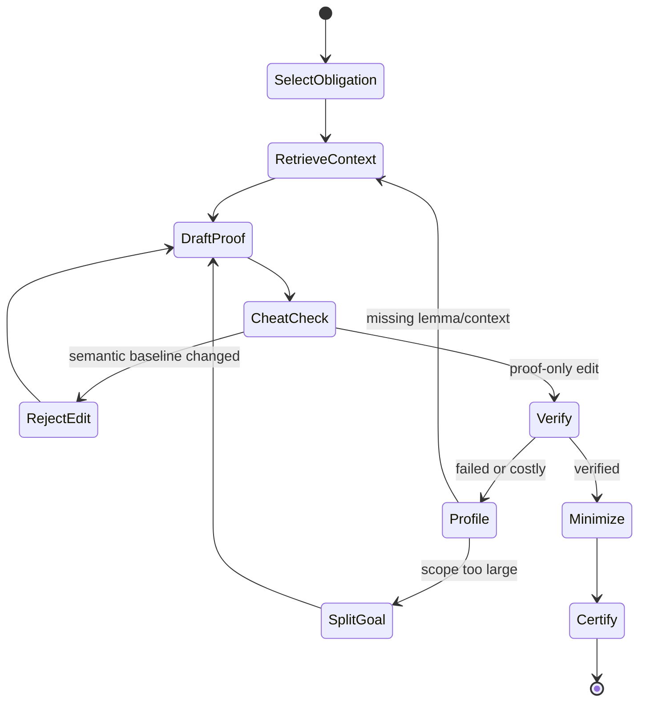

# jcode Code Intelligence Fabric: Search and Formal-Verification Feeder Audit

- **Date:** 2026-08-16
- **Status:** Non-normative evidence record; search/formal amendment set incorporated into architecture specification 2.0.0
- **Companion specification:** `2026-08-16-jcode-code-intelligence-fabric-design.md`
- **Repositories:** Verus, ripgrep, Rudra, and Kani

**Disposition:** The amendment set in section 12 and the recommended Option A boundary are accepted in design specification 2.0.0 and implementation plan 2.0.0. This audit preserves pinned source findings, negative controls, and adoption/rejection evidence. Canonical operation names, result dispositions, architecture status, and delivery gates are defined by the design and plan.

## 1. Executive verdict

These four repositories materially strengthen the design, but they should not be combined into one monolithic analyzer and they do not form a linear ladder of truth.

- **ripgrep** supplies the strongest T0 foundation in this set: fast byte-exact discovery, mature ignore traversal, streaming search, explicit binary and encoding behavior, machine-readable output, and a useful early index design. Its failure history proves that a negative search answer is trustworthy only when accompanied by a complete search plan and coverage ledger.
- **Rudra** supplies compact rustc/MIR patterns for a fast T3 unsafe-risk screen: panic safety, unsafe destructors, and Send/Sync variance. Its non-interprocedural design, known false-positive fixture, wrapper limitations, and weak outcome accounting mean it should generate triage evidence, never proof.
- **Kani** supplies bounded model checking, concrete counterexamples, function and loop contracts, harness discovery, stubbing, reachability, and property-level results. It is strongest when jcode can state the harness domain, bounds, assumptions, and reachability expectations. A successful Kani run is a bounded claim, not an unqualified theorem.
- **Verus** supplies deductive verification, executable/specification/proof modes, contracts, invariants, termination, ghost and tracked state, concurrency state machines, proof profiling, and proof-dependency handling. It can support the strongest static claims in this set, but only when its assumptions, imported specifications, macros, disabled checks, solver configuration, and trusted computing base are included in the certificate.

The accepted architecture is therefore a shared evidence kernel with four distinct adapters:

1. embed ripgrep's stable search and traversal crates where their contracts fit;
2. implement a jcode-owned, no-false-negative candidate index rather than adopting ripgrep's work-in-progress index as-is;
3. add a Rudra-derived unsafe screening provider behind the existing pinned rustc/Dylint provider boundary;
4. invoke version-pinned Kani and Verus sidecars through normalized formal-verification contracts.

The most important cross-cutting mechanisms incorporated into the 2.0.0 evidence model are `SearchPlan`, `SearchCoverageLedger`, `IndexSnapshotManifest`, `ExpectedHarnessSet`, `ProofObligation`, `TrustLedger`, `ProofDependencyGraph`, `CounterexampleArtifact`, `VacuityAndCoverageGate`, and a proof-repair loop with a semantic cheat checker.

## 2. Audit method and pinned revisions

The audit inspected pinned repository trees, implementation source, tests, documentation, release metadata, and selected open and resolved issues or pull requests. README and guide claims were checked against code wherever practical. Experimental and proposed code is identified as such instead of being treated as shipped behavior.

| Repository | Audited revision | Release context | Main role |
|---|---|---|---|
| [verus-lang/verus](https://github.com/verus-lang/verus/tree/7d4628a8543d3e51e6e314c52032c9bab43f0f53) | `7d4628a8543d3e51e6e314c52032c9bab43f0f53` | Rolling release, 2026-08-15 | T3 deductive verification |
| [BurntSushi/ripgrep](https://github.com/BurntSushi/ripgrep/tree/3fce3b5bb0236da2df6d99672afb8a719642eca7) | `3fce3b5bb0236da2df6d99672afb8a719642eca7` | 15.2.0, 2026-07-15 | T0 discovery and exact search |
| [shinmao/Rudra](https://github.com/shinmao/Rudra/tree/cb1ea83514410da599e0b1abfcc6d558e1ebd1a8) | `cb1ea83514410da599e0b1abfcc6d558e1ebd1a8` | No tagged release | T3 unsafe-risk screen |
| [model-checking/kani](https://github.com/model-checking/kani/tree/81fd3e4641699dd7f02561038d5ec0cfac9174cc) | `81fd3e4641699dd7f02561038d5ec0cfac9174cc` | 0.67.0, 2026-01-16 | T3 bounded model checking |

Repository sizes at the pinned revisions were approximately 1,605 tree entries/908 Rust files for Verus, 299/110 for ripgrep, 119/62 for Rudra, and 4,594/1,865 for Kani. This pass intentionally followed implementation paths rather than sampling README feature lists.

### 2.1 Evidence rules used by this audit

1. A documented feature is marked implemented only when a corresponding source path or test exists.
2. An open RFC or pull request is a design feeder, not current behavior.
3. A successful tool exit is not proof that expected work ran.
4. A skipped, unsupported, filtered, unreachable, timed-out, or silently ignored unit remains visible in coverage.
5. A proof is scoped to its program world, specification, solver/tool version, configuration, bounds, and trust inputs.
6. A negative search result is scoped to its exact traversal, ignore, encoding, binary, preprocessing, and engine policy.
7. Source-inspection suspicions are labeled as inferences until confirmed by an upstream test or issue.

## 3. Repository analysis

### 3.1 Verus

#### 3.1.1 What Verus contributes

Verus extends Rust with three modes—executable, specification, and proof—and verifies specifications through a rustc-derived frontend, VIR/AIR translation, and SMT solving. For jcode, its important capability is not merely “run a prover.” It supplies a vocabulary for describing why a Rust change is correct:

- function `requires` and `ensures` clauses;
- loop invariants and `decreases` measures;
- `no_unwind` and panic-related obligations;
- type invariants;
- ghost and tracked values for permissions and logical state;
- tokenized and concurrent state-machine specifications;
- proof functions, lemmas, triggers, and quantifier reasoning;
- module- and function-targeted proof execution;
- proof dependency import/export, pruning, and solver query isolation.

Relevant implementation paths include the [driver and verifier](https://github.com/verus-lang/verus/tree/7d4628a8543d3e51e6e314c52032c9bab43f0f53/source/rust_verify/src), [AIR solver integration](https://github.com/verus-lang/verus/tree/7d4628a8543d3e51e6e314c52032c9bab43f0f53/source/air/src), [VIR pruning and reachability](https://github.com/verus-lang/verus/tree/7d4628a8543d3e51e6e314c52032c9bab43f0f53/source/vir/src), and [state-machine macro implementation](https://github.com/verus-lang/verus/tree/7d4628a8543d3e51e6e314c52032c9bab43f0f53/source/state_machines_macros/src).

#### 3.1.2 Query isolation and proof-cost evidence

Verus divides verification into query “buckets,” normally by module or by a function marked for a separate prover query. It supports module/function filters and parallel verification, making it suitable for risk-targeted checks rather than whole-workspace invocation after every edit. jcode should preserve those query boundaries as first-class records rather than flattening all proof output into one run.

The profiler records per-function SMT time, resource limits, and expensive quantifier instantiations. The quantifier profiler is especially valuable to agents because it identifies causal proof cost, not just wall-clock time. This enables a disciplined repair policy:

1. target the smallest failing function or proof bucket;
2. retrieve relevant definitions and existing lemmas;
3. inspect expensive quantifier instantiations;
4. change proof structure or triggers before raising the resource limit;
5. raise a resource limit only within a recorded budget;
6. minimize a successful proof after verification.

Source anchors: [buckets](https://github.com/verus-lang/verus/blob/7d4628a8543d3e51e6e314c52032c9bab43f0f53/source/rust_verify/src/buckets.rs), [user filters](https://github.com/verus-lang/verus/blob/7d4628a8543d3e51e6e314c52032c9bab43f0f53/source/rust_verify/src/user_filter.rs), and [profiler](https://github.com/verus-lang/verus/blob/7d4628a8543d3e51e6e314c52032c9bab43f0f53/source/rust_verify/src/profiler.rs).

#### 3.1.3 Machine-readable proof artifacts

Verus has JSON output tests and records proof notes, errors, verification counts, and timing. Its record facility packages source, dependencies, output, and version information into a reproducibility archive. Record-history keeps invocation/source/result history in a bare Git repository. These are unusually strong feeders for jcode's proof-carrying memory.

`proof_note` annotations can label preconditions, postconditions, assertions, and assumptions so diagnostics refer back to human-meaningful obligations. Current behavior does not guarantee globally stable or mandatory labels; [issue 2150](https://github.com/verus-lang/verus/issues/2150) discusses stronger labeling. jcode should therefore generate its own stable obligation identity before invoking Verus and map any Verus proof notes onto it.

Source anchors: [record](https://github.com/verus-lang/verus/blob/7d4628a8543d3e51e6e314c52032c9bab43f0f53/source/verus/src/record.rs), [record history](https://github.com/verus-lang/verus/blob/7d4628a8543d3e51e6e314c52032c9bab43f0f53/source/verus/src/record_history.rs), and [JSON-output tests](https://github.com/verus-lang/verus/blob/7d4628a8543d3e51e6e314c52032c9bab43f0f53/source/rust_verify_test/tests/output_json.rs).

#### 3.1.4 The agent proof-writing loop is itself a feeder

Verus contains an unusually relevant [guide for using LLMs to write proofs](https://github.com/verus-lang/verus/blob/7d4628a8543d3e51e6e314c52032c9bab43f0f53/source/docs/guide/src/llmforverusproof.md). Its practical findings should become jcode behavior:

- give the agent a coding loop with the verifier, not a one-shot prompt;
- retrieve `vstd`, project lemmas, tests, and guide material before synthesizing a lemma;
- expose complete diagnostics and expanded errors;
- freeze executable code and specifications unless the task explicitly authorizes changing them;
- reject `assume`, `admit`, and equivalent proof shortcuts;
- checkpoint large proof tasks and split them into bounded subgoals;
- treat large invariants, macros, opaque specifications, and large proof scopes as escalation signals;
- budget resource-limit changes instead of letting the agent hide bad proof structure behind a large solver budget;
- run a proof minimizer because generated proofs are often more verbose than necessary.

This suggests the native `code(operation=prove_repair)` workflow with immutable semantic baselines, allowed proof-edit regions, a proof-attempt ledger, lemma retrieval, verifier feedback, cheat checking, and final proof minimization.

#### 3.1.5 Trust boundary and cheating controls

Verus has a `--no-cheating` mode and tests that reject constructs such as `assume`, `admit`, external bodies, assumed specifications, and assumed termination. That flag should be mandatory for any claim-bearing jcode verification, but it is not a complete trust model.

The certificate must still disclose:

- all assumptions and admitted or externally specified behavior;
- external bodies, functions, and trait implementations;
- imported proof metadata and broadcast axioms;
- macros that translate declarations into proof obligations or assumptions;
- solver binary/version and solver resource limits;
- disabled lifetime, erasure, unwind, termination, or verification checks;
- selected modules/functions and pruned dependencies;
- whether the claim is partial or total correctness.

The state-machine macros are a concrete reason for macro provenance. Their safety-condition generation can translate a `require(A)`-style premise into an assumption used to prove the generated transition. The soundness claim therefore trusts the macro expansion and its version, not only the visible source. See [state-machine safety conditions](https://github.com/verus-lang/verus/blob/7d4628a8543d3e51e6e314c52032c9bab43f0f53/source/state_machines_macros/src/safety_conditions.rs).

#### 3.1.6 Failure history that must become regression tests

| Upstream evidence | What failed | Required jcode invariant |
|---|---|---|
| [Issue 2766](https://github.com/verus-lang/verus/issues/2766), fixed by [PR 2775](https://github.com/verus-lang/verus/pull/2775) | A syntactic identity check ignored type arguments and could support an invalid proof | Proof identities include full generic substitutions, type arguments, trait instance, and world identity |
| [Issue 2768](https://github.com/verus-lang/verus/issues/2768), fixed by [PR 2777](https://github.com/verus-lang/verus/pull/2777) | An unsound finite-set assumption was broadcast through the proof environment | Trust ledger records assumptions and transitive broadcast dependencies; removed axioms invalidate derived facts |
| [Issue 2689](https://github.com/verus-lang/verus/issues/2689), fixed by [PR 2693](https://github.com/verus-lang/verus/pull/2693) | A trait-method extension specification was missing from proof-call ordering | Proof dependency graph includes trait/extension-spec edges and is checked for ordering parity |
| [Issue 2814](https://github.com/verus-lang/verus/issues/2814), fixed by [PR 2815](https://github.com/verus-lang/verus/pull/2815) | A local constant inside a closure crashed verification | Stable nested-item identities and crash-isolated query buckets |
| [Issue 2036](https://github.com/verus-lang/verus/issues/2036) | Termination/decrease behavior has incomplete cases | Unsupported termination cases yield `unknown` or `unsupported`, never total-correctness proof |

These cases are more valuable than generic “prove a correct function” tests because they exercise identity, dependency, assumption, nesting, and completeness—the exact places an agent-facing evidence fabric can become overconfident.

#### 3.1.7 Adopt, adapt, and reject

**Adopt:** targeted proof buckets, JSON diagnostics, proof notes, record bundles, proof profiling, no-cheating mode, dependency metadata, contracts, invariants, termination obligations, and countermodels where available.

**Adapt:** generate jcode-owned stable obligation IDs; normalize assumptions and imported proof dependencies into a `TrustLedger`; preserve per-query outcomes; expose proof cost to the scheduler; add a semantic-diff cheat checker; and make proof minimization a post-pass.

**Reject:** treating a zero-error process exit as sufficient proof, raising resource limits without a bound, accepting changed executable/specification code during proof repair, or promoting a result without its trusted inputs and disabled-check list.

### 3.2 ripgrep

#### 3.2.1 What ripgrep contributes

ripgrep is the right source base for the T0 search plane because its implementation is decomposed into reusable crates rather than only a CLI. The most relevant components are:

- `grep-searcher` for buffered, memory-mapped, and multiline search;
- `grep-matcher` and regex/PCRE2 adapters;
- `grep-printer` for structured match, context, statistics, and JSON output;
- `ignore` for parallel directory walking, ignore precedence, overrides, hidden files, symlinks, loops, depth, and file-size limits;
- `globset` for compiled glob matching;
- CLI decompression and preprocessor orchestration.

The [workspace crates](https://github.com/BurntSushi/ripgrep/tree/3fce3b5bb0236da2df6d99672afb8a719642eca7/crates) provide a mature implementation boundary that jcode can embed without parsing terminal output.

#### 3.2.2 The search lifecycle is useful but incomplete for agent evidence

The `Sink` interface has `begin`, `matched`, `context`, `context_break`, `binary_data`, and `finish` callbacks. A callback can stop search normally, and an error immediately stops search. Critically, the implementation contract states that `finish` is not called after an error. jcode must therefore synthesize a terminal `ResultDisposition` and coverage record even when an upstream searcher never emits a normal finish event.

Multiline search can return a span containing more than one logical match. JSON grouping can differ between regex engines, as shown by [issue 3364](https://github.com/BurntSushi/ripgrep/issues/3364). jcode should normalize raw engine events into match atoms with byte ranges and preserve the original grouping as provenance.

Source anchor: [search sink](https://github.com/BurntSushi/ripgrep/blob/3fce3b5bb0236da2df6d99672afb8a719642eca7/crates/searcher/src/sink.rs).

#### 3.2.3 Traversal semantics belong in every search result

ripgrep distinguishes explicitly named paths from paths found by recursive discovery: explicit files are normally searched even when discovery filters would have omitted them. Ignore precedence, hidden-file behavior, overrides, file types, symlinks, loops, maximum depth, maximum file size, one-file-system behavior, and filesystem errors can all change the candidate universe.

The parallel walker uses a work-stealing strategy with local depth-first stacks. Sorting forces different execution constraints, and thread count changes ordering and sometimes which failure becomes visible first. These are not mere performance settings when an agent uses “no matches” as evidence.

jcode must therefore attach a `SearchPlan` and `SearchCoverageLedger` to every negative or completeness-sensitive result. A human-facing `code.find` response can remain compact, but the ledger must be retrievable.

Source anchors: [parallel walk](https://github.com/BurntSushi/ripgrep/blob/3fce3b5bb0236da2df6d99672afb8a719642eca7/crates/ignore/src/walk.rs), [ignore construction](https://github.com/BurntSushi/ripgrep/blob/3fce3b5bb0236da2df6d99672afb8a719642eca7/crates/ignore/src/dir.rs), and [high-level arguments](https://github.com/BurntSushi/ripgrep/blob/3fce3b5bb0236da2df6d99672afb8a719642eca7/crates/core/flags/hiargs.rs).

#### 3.2.4 Encoding, binary, multiline, and memory strategy

ripgrep handles BOM detection, explicit encodings, invalid UTF-8, binary heuristics, line-oriented and multiline modes, and JSON-safe representation of arbitrary paths or match bytes. Invalid UTF-8 is represented losslessly in structured output rather than silently replaced, which should be retained in jcode's source-witness representation.

Binary detection is heuristic and can terminate or alter reporting after a NUL byte. Buffered, whole-file, and memory-mapped strategies do not have identical failure boundaries. The memory-map implementation explicitly warns that concurrent file truncation can cause a `SIGBUS` and abort the process. A long-lived jcode daemon should default to buffered search and allow mmap only on snapshot-stable files in a crash-isolated worker.

Source anchors: [searcher configuration](https://github.com/BurntSushi/ripgrep/blob/3fce3b5bb0236da2df6d99672afb8a719642eca7/crates/searcher/src/searcher/mod.rs), [mmap search](https://github.com/BurntSushi/ripgrep/blob/3fce3b5bb0236da2df6d99672afb8a719642eca7/crates/searcher/src/searcher/mmap.rs), and [JSON printer](https://github.com/BurntSushi/ripgrep/blob/3fce3b5bb0236da2df6d99672afb8a719642eca7/crates/printer/src/json.rs).

#### 3.2.5 Compression and preprocessors are untrusted execution boundaries

ripgrep can invoke external decompressors and preprocessors. Some missing decompressor binaries can be ignored, and certain preprocessor failures can fall back or surface differently depending on mode. [Issue 3382](https://github.com/BurntSushi/ripgrep/issues/3382) shows corrupted compressed input producing mode-dependent partial behavior, including a misleading no-match outcome.

jcode should not inherit silent fallback semantics. It should:

1. resolve the exact executable and hash/version it where practical;
2. run it in the provider sandbox with time, output, and memory bounds;
3. distinguish `not_installed`, `unsupported`, `spawn_failed`, `nonzero_exit`, `partial_output`, and `decoded_complete`;
4. attach original and decoded content identities;
5. forbid `complete_empty` if preprocessing did not complete;
6. make preprocessors opt-in for untrusted repositories.

The names above are nested transform-status reason codes, not additional `ResultDisposition` variants. Canonical envelope mapping is: `not_installed` to `unavailable`; `spawn_failed` to `failed`; `nonzero_exit` or `partial_output` to `failed`/`partial` according to retained bytes and coverage; and `decoded_complete` to a completed transform unit within `complete_nonempty` or `complete_empty` as determined by the subsequent search. Transform success alone never determines search disposition.

Source anchor: [decompression orchestration](https://github.com/BurntSushi/ripgrep/blob/3fce3b5bb0236da2df6d99672afb8a719642eca7/crates/cli/src/decompress.rs).

#### 3.2.6 The index work is valuable as an invariant, not an implementation

ripgrep's active core index integration is effectively a stub: write mode opens an index, while read mode still performs exhaustive search. The separate `crates/index` package labels itself work in progress and its literal query analysis is prototype code. That is useful research, but not a production dependency for jcode.

The strongest idea is in [RFC issue 1497](https://github.com/BurntSushi/ripgrep/issues/1497): an index should be an **unranked candidate filter with no false negatives**, and candidate files should still be confirmed by the normal searcher. It should be regenerable, versioned, safe under stale/corrupt state, and optional when its candidate set is too broad.

jcode should implement these invariants:

- index only narrows candidates; it never supplies final match truth;
- query planning can bypass the index when the Boolean n-gram expression is weak;
- every query either uses a policy-compatible index or explicitly falls back to direct traversal;
- newer/dirty files are searched through the live overlay, deleted files through tombstones;
- large or excluded files remain typed exclusions, not invisible absences;
- segment corruption or version mismatch triggers fail-closed fallback/rebuild;
- the index records its discovery-policy fingerprint, n-gram parameters, source generation, and file identities.

A source inspection of [the prototype literal analyzer](https://github.com/BurntSushi/ripgrep/blob/3fce3b5bb0236da2df6d99672afb8a719642eca7/crates/index/src/literal.rs) also suggests a suspicious concatenation bound that combines the current analysis length with itself rather than the next term. This is an audit inference, not a confirmed upstream defect; it reinforces the decision to adopt the invariant and differential tests rather than copy the prototype.

#### 3.2.7 Failure history that must become regression tests

| Upstream evidence | Failure class | Required jcode test |
|---|---|---|
| [Issue 3508](https://github.com/BurntSushi/ripgrep/issues/3508) | PCRE2 multiline/lookaround or anchor case silently misses a match | Cross-engine differential corpus plus positive and negative controls |
| [Issue 3382](https://github.com/BurntSushi/ripgrep/issues/3382) | Corrupt compressed stream can look empty in some execution modes | Partial decode can never produce `complete_empty` |
| [Issue 3494](https://github.com/BurntSushi/ripgrep/issues/3494) | Large-tree concurrent musl build can segfault | Crash-isolated walker, checkpointed coverage, deterministic single-thread retry |
| [Issue 3009](https://github.com/BurntSushi/ripgrep/issues/3009) and unmerged [PR 3010](https://github.com/BurntSushi/ripgrep/pull/3010) | Visitor panic can strand walker coordination | Catch worker panic, cancel peers, emit `crashed`, never deadlock |
| [Issue 2884](https://github.com/BurntSushi/ripgrep/issues/2884) | Search optimization caused false negatives | Optimization-off oracle in conformance and fuzz testing |
| [Issue 3364](https://github.com/BurntSushi/ripgrep/issues/3364) | Engine/multiline JSON grouping differs | Normalize atom spans while preserving engine grouping |

#### 3.2.8 Adopt, adapt, and reject

**Adopt:** stable searcher/matcher/printer/ignore/glob crates, lossless byte spans, streaming lifecycle, bounded output, traversal controls, statistics, and structured JSON semantics.

**Adapt:** wrap every search in a policy fingerprint and coverage ledger; add crash isolation and deterministic retry; normalize match atoms; sandbox preprocessing; use buffered search by default; and implement a fresh no-false-negative index layer.

**Reject:** using CLI exit code or an empty match list as completeness proof, trusting a stale index without overlay/tombstones, silently ignoring preprocessors, copying the work-in-progress index, or treating mmap as universally safe in the daemon.

### 3.3 Rudra

#### 3.3.1 What Rudra contributes

Rudra is compact enough to expose several reusable rustc/MIR analysis patterns clearly. Its three main analyses are:

1. **Unsafe destructor analysis:** identifies unsafe operations in `Drop` implementations, where panic and partially initialized state are especially dangerous.
2. **Unsafe dataflow/panic-safety analysis:** follows lifetime-bypassing or raw-memory-related sources into generic/user code that may panic. Finding flags cover read/copy flow, `Vec::from_raw_parts`, transmute, write flow, pointer-to-reference conversion, unchecked slice access, raw slice construction, and `Vec::set_len`.
3. **Send/Sync variance analysis:** detects generic, phantom, API, naive, strict, and relaxed patterns where an unsafe `Send` or `Sync` implementation may not constrain contained types correctly.

The implementation combines MIR control-flow traversal, bitflag taint state, strongly connected components/topological graph helpers, and source-level reports. Relevant paths: [unsafe dataflow](https://github.com/shinmao/Rudra/blob/cb1ea83514410da599e0b1abfcc6d558e1ebd1a8/src/analysis/unsafe_dataflow.rs), [unsafe destructor](https://github.com/shinmao/Rudra/blob/cb1ea83514410da599e0b1abfcc6d558e1ebd1a8/src/analysis/unsafe_destructor.rs), [Send/Sync variance](https://github.com/shinmao/Rudra/tree/cb1ea83514410da599e0b1abfcc6d558e1ebd1a8/src/analysis/send_sync_variance), and [graph helpers](https://github.com/shinmao/Rudra/blob/cb1ea83514410da599e0b1abfcc6d558e1ebd1a8/src/graph.rs).

#### 3.3.2 Correct role: fast screen, not proof

The unsafe dataflow analysis is explicitly intraprocedural. Safe callees are generally trusted; unresolved generic/user-provided calls are approximated as potentially panicking. This is a useful asymmetry for triage—it highlights dangerous patterns cheaply—but it cannot prove absence across call boundaries.

Each finding should therefore become an `UnsafePatternFinding` with:

- source operation and source span;
- sink/call and sink span;
- MIR block/path witness;
- finding class and severity;
- generic/dispatch approximation used;
- interprocedural coverage boundary;
- unsupported constructs and dropped paths;
- confidence/calibration version;
- suggested escalation lane.

The result should say “pattern observed under this abstraction,” not “memory unsafe” or “safe.”

#### 3.3.3 False positives and calibration

Rudra includes a test fixture named [`sync_over_send_fp.rs`](https://github.com/shinmao/Rudra/blob/cb1ea83514410da599e0b1abfcc6d558e1ebd1a8/tests/send_sync/sync_over_send_fp.rs) that describes a valid ownership-transfer channel but still emits an error by default. This is valuable honesty in the corpus: the provider needs explicit approximation labels, suppressions, and measured precision/recall rather than a binary lint authority.

jcode should retain two distinct notions:

- **finding severity:** potential consequence if real;
- **finding confidence:** likelihood under the analyzer's abstraction and calibration set.

Only a conformant, calibrated detector becomes auto-enabled. A high-severity/low-confidence screen can still trigger Kani, Verus, a deeper RAPx analysis, or focused human review.

#### 3.3.4 Wrapper and coverage weaknesses

The cargo wrapper exposes implementation constraints that jcode should not reproduce:

- workspaces are unsupported;
- an existing `RUSTC_WRAPPER` is not composed cleanly;
- package cleaning is used to bypass Cargo freshness;
- analysis focuses on lib/bin targets;
- target and relative-path heuristics are fragile;
- rustc-private API/toolchain coupling is strong;
- the wrapper has a coarse one-hour timeout;
- `Unreachable`, `Unimplemented`, and `OutOfScope` cases are logged but are not a per-unit coverage ledger.

The test harness compares the set of analyzer names more than the exact source/sink paths, coverage, and dispositions. jcode needs stronger golden tests: exact stable location/identity, path witness, outcome, dropped-unit accounting, and negative controls. See [cargo wrapper](https://github.com/shinmao/Rudra/blob/cb1ea83514410da599e0b1abfcc6d558e1ebd1a8/src/bin/cargo-rudra.rs) and [test driver](https://github.com/shinmao/Rudra/blob/cb1ea83514410da599e0b1abfcc6d558e1ebd1a8/test.py).

#### 3.3.5 Source-inspection warning

The `GraphTaint` implementation in `unsafe_dataflow.rs` appears to implement its trait-level `is_empty` operation by returning `is_all`. The graph worklist uses `is_empty` to decide whether sources and propagated states contain taint. This looks inverted: a default empty state may be scheduled unnecessarily, while an all-bits state could be treated as empty. Normal paths may still call the bitflags type's inherent method, so this is an **apparent defect inferred from source inspection**, not a confirmed upstream issue.

jcode should not transplant this code. It should use the analysis concept and build:

- algebraic tests for empty, single-bit, multi-bit, and all-bit states;
- monotonicity and join/idempotence property tests;
- path-order metamorphic tests;
- a reference slow solver for small graphs;
- exact regression fixtures for every source/sink class.

#### 3.3.6 Adopt, adapt, and reject

**Adopt:** the detector taxonomy, MIR source/sink representation, panic-safety framing, Send/Sync variance patterns, SCC/topological utilities, severity tiers, and a cheap unsafe-change screen.

**Adapt:** run inside jcode's pinned rustc provider runtime; make workspaces and target selection explicit; emit full coverage/disposition; add interprocedural boundary fields; calibrate confidence; and escalate uncertain high-impact findings.

**Reject:** copying the wrapper, treating logged unsupported cases as successful coverage, declaring absence of findings as safety, or copying taint code without oracle/property tests.

### 3.4 Kani

#### 3.4.1 What Kani contributes

Kani is a bounded model checker for Rust. It is particularly useful to jcode when a change involves finite-state behavior, panics, arithmetic, memory safety, contracts, or a concrete counterexample that ordinary tests may not generate.

Important implemented capabilities include:

- proof harnesses and project-level harness discovery;
- nondeterministic inputs and assumptions;
- assertion, panic, overflow, bounds, uninitialized-memory, and undefined-behavior checks;
- function contracts with `requires`, `ensures`, and frame/modifies information;
- loop contracts with invariant, modifies, and decreases clauses;
- stubbing and verified stubs;
- per-harness unwind bounds and solvers;
- harness timeouts, parallel jobs, and fail-fast execution;
- reachability and points-to/vtable-restriction analyses;
- automatic harness generation with skip reasons;
- property-level JSON parsing, SARIF, harness listing, and source-coverage data;
- concrete playback test generation for supported counterexamples.

Source anchors: [harness metadata](https://github.com/model-checking/kani/blob/81fd3e4641699dd7f02561038d5ec0cfac9174cc/kani_metadata/src/harness.rs), [harness runner](https://github.com/model-checking/kani/blob/81fd3e4641699dd7f02561038d5ec0cfac9174cc/kani-driver/src/harness_runner.rs), [CBMC output parser](https://github.com/model-checking/kani/blob/81fd3e4641699dd7f02561038d5ec0cfac9174cc/kani-driver/src/cbmc_output_parser.rs), and [compiler transformations](https://github.com/model-checking/kani/tree/81fd3e4641699dd7f02561038d5ec0cfac9174cc/kani-compiler/src/kani_middle/transform).

#### 3.4.2 Property outcomes are richer than pass/fail

Kani/CBMC properties can be `Failure`, `Covered`, `Satisfied`, `Success`, `Undetermined`, `Unreachable`, `Unknown`, `Unsatisfiable`, or `Error`. Kani's verification result construction usefully does not trust the raw process exit code alone; it requires property results and treats a missing result set as a failure class.

jcode should preserve property outcomes and group them into exhaustive buckets:

- proved/satisfied under the configured bound;
- disproved with counterexample;
- unreachable or vacuous;
- undetermined/unknown;
- unsupported;
- timed out/resource exhausted;
- tool/parser error;
- missing expected property.

No aggregate “success” is emitted until every expected property has exactly one terminal bucket and the selection/coverage gate passes.

#### 3.4.3 Harness inventory is part of proof semantics

`kani list` reports standard and contract harnesses and can expose uncovered contracts. Auto-harness generation skips unsupported functions such as some generic, pointer-heavy, or invariant-constrained cases and reports reasons. This should feed an `ExpectedHarnessSet`, not remain a log line.

The expected set should be derived from:

1. the analysis world's Rust item graph;
2. explicit `#[kani::proof]` and contract annotations;
3. Kani's own harness listing;
4. jcode-generated harness specifications;
5. risk policy for changed functions and affected callers.

An unmatched harness filter, zero selected harnesses, or a removed harness must be a typed non-success whenever the task expected verification. A library with intentionally no harnesses may still complete successfully for an inventory-only query, but that is a different contract.

Source anchors: [list output](https://github.com/model-checking/kani/blob/81fd3e4641699dd7f02561038d5ec0cfac9174cc/kani-driver/src/list/output.rs), [autoharness](https://github.com/model-checking/kani/blob/81fd3e4641699dd7f02561038d5ec0cfac9174cc/kani-driver/src/autoharness/mod.rs), and [zero-harness behavior test](https://github.com/model-checking/kani/tree/81fd3e4641699dd7f02561038d5ec0cfac9174cc/tests/cargo-kani/zero-harnesses-is-success).

#### 3.4.4 Bounds, reachability, and vacuity

A bounded proof is meaningful only when its bounds and reachability are visible. Loop unwinding assertions determine whether exploration covered the requested loop behavior. Loop contracts prove partial correctness unless a valid decreases argument also establishes termination. Assumptions can overconstrain the domain, while an assertion can “pass” because its path is unreachable.

The jcode `VacuityAndCoverageGate` must require:

- satisfiable harness preconditions or an explicit expected-unsatisfiable claim;
- reachability of required assertions and postconditions;
- successful unwinding assertions or an explicitly bounded claim;
- domain/partition coverage when proofs are split;
- no unexpected `assume(false)` or equivalent path elimination;
- an explicit distinction between partial and total correctness;
- every expected property/harness accounted for.

Kani's [partitioned proof RFC](https://github.com/model-checking/kani/blob/81fd3e4641699dd7f02561038d5ec0cfac9174cc/rfc/src/rfcs/0014-harness-partition.md) reinforces the need for a separate coverage harness so case splits cannot omit part of the input domain.

#### 3.4.5 Contracts and stubs are trust inputs

Function-contract proof and caller use are different obligations. Proving a contract with an underconstrained or overconstrained harness is not enough; callers must establish the precondition. A verified stub replaces an implementation with contract behavior and is therefore axiom-like at the caller boundary.

Every certificate must list:

- contracts assumed and contracts proved;
- exact contract harness and generated input domain;
- ordinary and verified stubs;
- functions excluded by autoharness and why;
- lifetime information erased or approximated by stubbing;
- loop invariant and decreases side effects;
- recursive or mutually recursive unsupported cases.

[Discussion in issue 3950](https://github.com/model-checking/kani/issues/3950) is a useful warning that a proof-contract harness can miss valid inputs and that callers still need precondition obligations. The [stubbing guide](https://github.com/model-checking/kani/blob/81fd3e4641699dd7f02561038d5ec0cfac9174cc/docs/src/reference/experimental/stubbing.md) should be treated as a trust-boundary guide, not merely an API tutorial.

#### 3.4.6 Concrete playback is corroboration, not universal replay

Kani can generate concrete Rust tests from some counterexamples. This is extremely useful for agents: a failing symbolic trace can become an executable regression test before the repair is attempted. But playback does not cover every property type, can struggle with multiple failures, and depends on compatible Kani/version/options and generated values.

jcode should store two linked but distinct artifacts:

- a T3 `CounterexampleArtifact` containing the symbolic assignment, violated property, trace, bounds, and solver identity;
- an optional T4 runtime corroboration record containing generated test identity, build world, execution outcome, and observed failure.

A non-replayable undefined-behavior or symbolic failure remains a valid T3 counterexample; it is labeled `replay_unsupported`, not discarded. Source anchor: [concrete playback generator](https://github.com/model-checking/kani/blob/81fd3e4641699dd7f02561038d5ec0cfac9174cc/kani-driver/src/concrete_playback/test_generator.rs).

#### 3.4.7 Soundness and documentation provenance

Kani's [soundness documentation](https://github.com/model-checking/kani/blob/81fd3e4641699dd7f02561038d5ec0cfac9174cc/docs/src/soundness.md) explicitly lists limitations around concurrency/data races, aliasing and provenance models, assembly/ABI behavior, transmute, loop bounds, object-bit limits, and flags that disable checks. Those limitations must be machine-readable certificate fields.

The pinned documentation also illustrates why jcode must validate documentation provenance: a virtual-table restriction note links to issue 3134, but that issue does not appear to describe the cited soundness problem, while [issue 802](https://github.com/model-checking/kani/issues/802) discusses the relevant imprecision/completeness concern and says it is not itself a soundness issue. The lesson is not that one side is definitively correct; it is that a memory system must retain source version and confidence for documentation-derived claims.

#### 3.4.8 Reporting and resource failure history

| Upstream evidence | Failure class | Required jcode invariant |
|---|---|---|
| [Issue 4731](https://github.com/model-checking/kani/issues/4731) | Zero-match filtering, quiet mode, stale export, result statistics, and pretty-name collisions can misrepresent the run | Expected-work manifest, stable qualified IDs, fresh atomic export, explicit `run_complete` |
| [Issue 4729](https://github.com/model-checking/kani/issues/4729) | Fail-fast can discard already completed harness results | Publish all completed terminal results plus cancellation disposition for the rest |
| Open [export JSON PR 4727](https://github.com/model-checking/kani/pull/4727) | Proposed schema includes tool/config/selection/outcome/property buckets and unmatched filters | Use as a design feeder only; implement a jcode-owned versioned schema now |
| [Issue 4667](https://github.com/model-checking/kani/issues/4667) | Symbolic heap readback can multiply variables and RSS even for small bounds | Cost model, per-harness budgets, partition/split, resource-exhausted outcome |
| [Issue 1150](https://github.com/model-checking/kani/issues/1150) | Object-bit offset wrapping creates a soundness boundary | Record object-bit configuration and block unsupported proof claims |

The current coverage result path also contains a summary function that is effectively a placeholder despite a coverage option. jcode must distinguish source-coverage artifacts that actually exist from an aggregate summary capability that is not implemented.

#### 3.4.9 Adopt, adapt, and reject

**Adopt:** harness metadata/listing, property-level outcomes, bounded contracts and checks, counterexamples, concrete playback, reachability, auto-harness skip reasons, per-harness parallelism/timeouts, SARIF/JSON concepts, and partition coverage.

**Adapt:** compute an expected harness/property universe; assign stable IDs before the CBMC boundary; normalize every terminal outcome; add vacuity/reachability gates; preserve completed results under fail-fast; record all bounds/trust inputs; and separate symbolic from runtime corroboration.

**Reject:** interpreting project exit status as proof, treating zero harnesses or unmatched filters as success when work was expected, omitting unreachable properties, treating a bounded proof as universal, or promoting a proof that relies on undisclosed stubs/assumptions/disabled checks.

## 4. Cross-repository synthesis

### 4.1 The evidence lanes are complementary

| Lane | Question answered | Strength | Principal blind spot |
|---|---|---|---|
| ripgrep discovery | “Where do these bytes/patterns occur under this policy?” | Exhaustive over a declared byte universe | Semantics; filtered or unreadable paths; engine/encoding policy |
| Rudra-style screen | “Does this unsafe-risk pattern occur in the analyzed MIR abstraction?” | Fast compiler-aware risk triage | Interprocedural behavior and proof of absence |
| Kani bounded model | “Does the property hold for this harness/domain/bound/configuration?” | Exhaustive within a stated bounded model | Uncovered domain, bounds, unsupported Rust semantics, assumptions |
| Verus deductive proof | “Does the specified property follow from these definitions and trusted assumptions?” | Deductive claim with explicit obligations | Incorrect/incomplete specification or trusted computing base |
| T4 replay/runtime | “Did this behavior occur for this artifact and execution?” | Concrete observation | Unobserved inputs/schedules; instrumentation effects |

An agent should combine lanes when they answer different parts of one claim. Examples:

- use ripgrep to find all explicit unsafe blocks, T2 to resolve affected functions, Rudra to screen patterns, then Kani for a bounded counterexample search;
- use Kani to discover a concrete failing case, turn it into a regression test, then use Verus to prove the repaired invariant when a stable specification exists;
- use Verus to prove a state-machine invariant, but use T4 concurrency/runtime evidence for implementation behavior outside the modeled assumptions;
- use a complete ripgrep search to confirm generated proof shortcuts are absent, but rely on Verus `--no-cheating` and the trust ledger for semantic enforcement.

### 4.2 Proposed T0–T4 placement

| Tier | New capability from this audit | Required boundary |
|---|---|---|
| T0 | Embedded ripgrep search/traversal, lossless byte witnesses, policy-aware negative results, no-false-negative candidate index | `SearchPlan`, `SearchCoverageLedger`, `IndexSnapshotManifest`; candidates never become semantic facts |
| T1 | Parse and attach proof notes/contracts/harness attributes; map raw unsafe source/sink spans; preserve macro expansion provenance | Syntax remains provisional; generated-code and macro blind spots explicit |
| T2 | Cargo/rustc world identity; expected function/harness/obligation universe; trait/extension-spec/proof dependency graph; stable qualified IDs | Full generic/trait instance identity and configuration fingerprints |
| T3a | Rudra-derived unsafe/panic/Send-Sync screen plus existing Dylint/RAPx providers | Finding confidence, interprocedural boundary, coverage and escalation |
| T3b | Kani bounded verification, contracts, reachability, counterexamples | Harness/domain/bounds/trust/vacuity certificate |
| T3c | Verus deductive verification, termination, ghost state, formal state machines | Specification/trust/dependency/solver/no-cheating certificate |
| T4 | Executable Kani playback and targeted runtime corroboration, alongside existing tests, hotpath, Wild, and Valgrind lanes | Artifact/execution identity; replay scope; no conversion of observation into universal proof |

T3a, T3b, and T3c are sibling evidence methods, not ordered subtiers. The scheduler may run only one, run them sequentially, or run complementary lanes in parallel according to the claim and budget.

## 5. Proposed normalized contracts

These contracts do not create a second evidence system. `SearchPlan` specializes the existing `QueryPlan`; `SearchCoverageLedger` specializes `CoverageLedger`; formal outcomes use the existing `ResultDisposition`, evidence dimensions, world identity, source witnesses, and atomic publication path; proof and trust edges live in the shared fact/graph store; and the resulting proof fields extend `VerificationCertificate`. Provider-native artifacts remain attachments to those canonical records.

### 5.1 SearchPlan

`SearchPlan` is a typed `QueryPlan` profile for exhaustive or completeness-sensitive byte discovery.

| Field family | Required content |
|---|---|
| Query | Literal/regex/glob/query AST, case policy, word/line policy, engine, engine limits |
| Roots | Explicit paths, discovered roots, workspace/world identity |
| Discovery | Hidden/ignore/type/override policy, symlink and filesystem-boundary policy, depth/size caps |
| Content | Encoding/BOM policy, binary policy, multiline mode, line terminator, memory strategy |
| Transformation | Decompressor/preprocessor executable identity, arguments, sandbox, fallback policy |
| Execution | Threads, sorting, timeout, output/match/byte caps, cancellation semantics |
| Compatibility | Stable policy fingerprint used by cache/index lookup |

### 5.2 SearchCoverageLedger

`SearchCoverageLedger` is the search profile of the canonical `CoverageLedger`, with path- and byte-specific terminal states.

The ledger records the expected roots and, for every resolved path or path class, one terminal state: searched-complete, searched-partial, filtered-with-reason, unreadable, transformed-complete, transformation-failed, binary-stopped, size/depth capped, vanished, crashed, or cancelled. It also records bytes read, match count, error spans, overlay generation, and a final completeness marker.

An empty result has three distinct meanings:

- `complete_empty`: all expected units reached an allowed terminal complete state;
- `partial` with an empty payload: no match was observed, but some unit was incomplete or excluded;
- `not_executed`: no expected unit was actually searched.

Only `complete_empty` can support a negative fact, and even then the fact is bound to the `SearchPlan` fingerprint and source world.

### 5.3 IndexSnapshotManifest

| Field | Purpose |
|---|---|
| `index_format` and `builder_version` | Reject incompatible or semantically changed segments |
| `source_world` and `base_generation` | Bind index to repository/target/config state |
| `discovery_policy_fingerprint` | Prevent querying an index built under different ignore/type rules |
| `ngram/query_parameters` | Prove query compatibility |
| Per-file content identity | Detect modification and support direct confirmation |
| Overlay and tombstone generations | Cover dirty/new/deleted files without stale positives or negatives |
| Exclusion ledger | Preserve oversized, unreadable, transformed, or unsupported files |
| Segment checksum/completeness | Fail closed on corruption or interrupted publication |

Index use is permitted only if the planner proves that the candidate expression is a no-false-negative relaxation of the requested query. Otherwise it performs direct traversal.

### 5.4 FormalVerificationContract

This is the pre-execution manifest paired with the post-execution `VerificationCertificate`; it uses the same analysis-world identity and atomic evidence transaction.

| Field family | Required content |
|---|---|
| Claim | Stable claim/obligation ID, kind, source witness, expected semantics |
| World | Source/Cargo/rustc target/features/profile/environment identity |
| Lane | Rudra screen, Kani bounded model, Verus deductive proof, or composition |
| Expected work | Harnesses, proof buckets, functions, properties, and required reachability |
| Configuration | Tool/solver versions, flags, bounds, unwind, timeout, memory, parallelism |
| Trust | Assumptions, stubs, external specs/bodies, macros, imports, disabled checks |
| Coverage | Selected/completed/skipped/unsupported units and partition/domain coverage |
| Outcome | Per-obligation terminal result plus aggregate completeness/vacuity decision |
| Artifacts | Raw output, normalized facts, proof record, counterexample, replay, profiles |

### 5.5 ProofObligation

Every obligation receives a jcode ID before crossing into a solver or tool-specific naming layer. The record contains:

- semantic owner with full generic substitution and trait instance;
- property kind: precondition, postcondition, assertion, invariant, termination, unwind, reachability, memory safety, panic safety, or user claim;
- source/specification witnesses and normalized formula digest;
- dependencies on other obligations, axioms, contracts, and macros;
- selected verification lane and configuration;
- terminal outcome and completeness;
- proof witness, proof record, or counterexample;
- trust-ledger and coverage-ledger references;
- freshness/reproducibility state.

Tool-generated names remain aliases. This prevents pretty-name collisions, parser heuristics, or generic erasure from conflating different obligations.

### 5.6 TrustLedger

The trust ledger is a dependency graph, not a prose caveat. Nodes include:

- source specification and executable-code digests;
- `assume`, `admit`, external body/spec/trait declarations;
- Kani ordinary/verified stubs and generated harness domains;
- Verus imported metadata and broadcast assumptions;
- macro producer/version/expansion identity;
- solver/toolchain binaries and relevant flags;
- disabled lifetime, erasure, unwind, termination, UB, assertion, or reachability checks;
- known modeling limitations such as concurrency, provenance, ABI, or inline assembly.

Changing or removing any node invalidates every derived proof fact reachable from it.

### 5.7 CounterexampleArtifact

| Field | Meaning |
|---|---|
| Violated obligation | Stable pre-solver ID and property kind |
| Symbolic witness | Assignments, trace, branch decisions, allocation/object identities |
| Model boundary | Bounds, assumptions, stubs, solver and unsupported semantics |
| Reproduction | Deterministic tool invocation and source record |
| Playback | Supported/unsupported reason, generated test identity, execution result |
| Repair link | Patch candidate and post-fix verification that blocks the same witness |

Counterexamples can be durable world-bound memory even when playback is unsupported, provided the symbolic artifact is complete and reproducible.

### 5.8 ProofDependencyGraph

The graph contains typed edges for ordinary calls, trait dispatch, extension specifications, imported contracts/axioms, type invariants, macro-generated obligations, broadcast facts, and proof-only lemma use. It serves four purposes:

1. compute the smallest proof context packet;
2. order or isolate solver queries;
3. invalidate dependent facts when a specification/trust input changes;
4. explain which assumptions and lemmas made a proof possible.

The graph identity includes full type arguments and selected implementation so the Verus identity failure cannot recur in normalized evidence.

## 6. Situation-aware agent routing

The capability orchestrator should compile the following rules into executable policy and generated agent documentation. They are defaults; repository policy and an explicit user request can override them.

| Situation | First action | Escalation | Avoid |
|---|---|---|---|
| Find text, attributes, unsafe blocks, macros, literals | T0 ripgrep search with explicit policy | T1/T2 identity resolution when meaning matters | Claiming semantic completeness from text alone |
| Agent says “there are no references/matches” | Require `complete_empty` coverage packet | Direct scan if index/policy mismatch | Remembering an uncovered empty list |
| Rename or API change | T2 references/call graph, T0 byte backstop | T3 for contracts/unsafe boundaries | Search-and-replace based only on byte hits |
| New or changed unsafe code | T2 impact set + T3a unsafe screen | Kani for finite counterexample search; Verus when a stable invariant/spec exists | Treating no screen finding as proof of safety |
| Panic-safety/raw-parts/`set_len` change | Rudra-style source/sink screen | Kani harness around ownership/error paths; Verus invariant if modeled | Testing only the happy path |
| Arithmetic, bounds, state machine with manageable domain | Kani harness and vacuity gate | Partition harnesses; Verus for unbounded theorem | Calling a bounded success universal |
| API contract or invariant requiring mathematical proof | Verus targeted proof bucket | Kani for counterexample discovery; T4 regression tests | Raising solver limits before inspecting proof cost |
| Verus proof repair | Retrieve vstd/project lemmas, freeze executable/spec baseline, iterate verifier | Split/checkpoint; bounded rlimit change; proof minimization | `assume`, `admit`, spec weakening, executable-code changes |
| Kani failure | Preserve symbolic counterexample | Generate playback test when supported, then patch and re-run | Discarding non-replayable failures |
| Kani success with unreachable properties | Mark vacuous/incomplete | Repair harness/preconditions or add coverage harness | Promoting aggregate success |
| Trait/generic proof | Resolve full instance and extension-spec edges | Separate proof buckets and dependency parity check | Pretty-name or generic-erased identity |
| Concurrency/data-race claim | Declare Kani limitation; use T2 model and appropriate runtime/formal lane | Verus tokenized state model if specification exists; T4 concurrency tooling | Claiming Kani default model proves race freedom |
| Search/index inconsistency | Direct buffered scan with optimizations/index off | Rebuild/quarantine index and compare engines | Trusting stale candidate set |
| Huge proof/search scope | Query-plan selectivity and cost estimate | Partition by module/harness/property with coverage proof | Silently dropping expensive units |

### 6.1 Router decision inputs

The router scores candidates using:

- claim type and required evidence strength;
- changed symbols, unsafe surface, contracts, and affected callers;
- provider availability, conformance, calibration, and health;
- expected work and expected selectivity;
- historical proof/search cost by stable unit;
- unsupported-language/model features;
- freshness of reusable evidence;
- user deadline/budget and repository policy;
- whether the action is navigation, diagnosis, change verification, or release certification.

A low score can suppress an optional provider, but it cannot suppress a mandatory safety or completeness gate. Every non-run mandatory provider receives an explicit waiver or blocked outcome.

### 6.2 Proof-repair state machine

The loop records every attempt, diagnostic delta, context retrieved, solver budget, and edit digest. Checkpoints make long proofs resumable and prevent the memory system from repeatedly exploring failed proof shapes.

## 7. Memory fusion and retrieval

### 7.1 Promotion rules by evidence type

| Evidence | Initial scope | Promotion condition | Invalidation |
|---|---|---|---|
| T0 match candidate | Query/session | Normally not promoted; source witness may attach to a fact | File/content or query-policy change |
| T0 complete negative | World + `SearchPlan` | Complete coverage, compatible index/direct confirmation, no exclusions relevant to claim | Content, overlay, policy, engine, preprocessor, or index generation change |
| Rudra screen finding | World + provider config | Exact witness, conformant/calibrated detector; corroboration raises confidence | MIR/toolchain/config or affected code change |
| Rudra no-finding | Run-local | Never promoted as general safety; only stored as screened coverage | Any analyzed-unit/config change |
| Kani counterexample | World + harness/model | Complete symbolic artifact and reproducible invocation; playback optional | Source/spec/harness/bound/stub/solver semantic change |
| Kani bounded proof | World + model | Expected harness/property complete, vacuity gate passes, trust ledger complete | Any model/bound/spec/trust/tool semantic change |
| Verus proof | World + specification/trust | No-cheating, expected obligations complete, proof record reproducible, trust ledger complete | Code/spec/dependency/macro/solver/tool/config change |
| Runtime playback | Artifact + execution | Reproducible generated test and observed result | Binary/build/input/environment change |
| Proof-repair lesson | Local strategy memory | Repeated success with traceable examples; never promoted as a theorem | Calibration decay or contradicted examples |

### 7.2 Fusion rules

1. Facts are fused only when stable semantic identities and analysis worlds are compatible.
2. A Rudra screen, Kani proof, Verus proof, and runtime observation remain separate evidence dimensions even when they support one conclusion.
3. Stronger evidence does not erase a weaker contradictory signal; it resolves it with an explanation or opens a conflict record.
4. Bounds and trust assumptions survive summarization. “Kani proved X” is never stored without the harness/domain/bound.
5. Negative search facts include exclusions and policy; excluded generated/vendor/binary content cannot disappear from memory prose.
6. Proof failures and counterexamples remain retrievable after a fix as historical evidence linked to the repairing change certificate.
7. Raw logs may be cold-stored, while normalized obligation, coverage, cost, and witness summaries remain hot.

### 7.3 Token-saving behavior

These mechanisms save tokens without weakening evidence:

- use T0 byte offsets to retrieve only relevant source slices;
- use T2 identities and the proof-dependency graph to compile minimal proof context;
- invoke Verus by function/bucket and Kani by harness rather than dumping whole-project output;
- store normalized property/obligation rows and fetch raw solver logs only on demand;
- summarize repeated diagnostics by stable obligation ID while preserving changed fields;
- reuse fresh complete-negative search packets instead of rescanning;
- retrieve vstd/project lemmas by signature and dependency proximity;
- keep counterexample assignments separate from large traces and render only the causal prefix;
- preserve exclusion counts and completeness markers in every compact packet.

Token savings must never be achieved by hiding unsupported units, unreachable properties, assumptions, or failed preprocessors.

## 8. Agent-facing capabilities

The live capability registry should expose at least these operations and generate corresponding agent guidance:

| Capability | Agent-facing purpose | Mandatory result contract |
|---|---|---|
| `agentgrep` / `code.find` | Execute bounded T0 search or ranked multi-tier search; return the exact byte-search universe when completeness matters | `SearchPlan`, matches, and `SearchCoverageLedger` |
| `code.capabilities` | Inspect search-index generation, policy compatibility, overlays, tombstones, health, and exact deep-operation schemas | `IndexSnapshotManifest` and capability claims |
| `code.verify_plan` | Select unsafe-screen/Kani/Verus/runtime lanes for a claim | `FormalVerificationContract` draft and rationale |
| `code.verify_unsafe_screen` | Fast MIR unsafe-risk triage | `UnsafePatternFinding[]` plus coverage |
| `code.verify_kani` | Run bounded proof/counterexample harnesses | Per-harness/property results and vacuity gate |
| `code.verify_verus` | Run deductive proof buckets | Per-obligation results, trust and proof profiles |
| `code.prove_repair` | Iteratively repair proof-only regions | Attempt ledger, semantic-diff guard, final certificate |
| `code.counterexample_materialize` | Generate a regression test where supported | Symbolic/replay linkage and limitations |
| `code.verify_explain` | Explain proof, failure, unknown, assumption, or exclusion | Evidence graph with source witnesses |

Capability cards should include positive and negative examples. In particular, cards must teach agents that:

- ripgrep answers byte discovery, not Rust meaning;
- Rudra findings are screens with known approximations;
- Kani results are bounded and harness-dependent;
- Verus results are specification- and trust-dependent;
- a T4 replay is concrete corroboration, not a universal proof;
- empty output is never self-authenticating.

The orchestrator's evaluation suite should test not only correct invocation syntax but whether an agent chooses the correct lane, notices a missing expected harness, refuses a vacuous proof, requests a complete negative-search packet, and avoids unauthorized specification weakening.

## 9. Implementation strategy

### 9.1 Option A — normalized adapters and a jcode-owned evidence kernel (recommended)

Embed the stable ripgrep crates for byte search/traversal. Build the candidate index, coverage ledger, identity mapping, expected-work manifests, proof contracts, trust graph, router, memory fusion, and certificates inside jcode. Invoke pinned Kani and Verus sidecars. Reimplement selected Rudra detector concepts behind the already planned rustc/Dylint provider runtime, with new conformance and property tests.

**Why this wins:** it gets mature search performance without inheriting a CLI boundary, isolates rustc-private and solver dependencies, keeps all truth/completeness semantics in one schema, and lets jcode upgrade proof engines without rewriting memory or agent tools.

### 9.2 Option B — vendor or fork all four engines deeply

Vendor ripgrep search/index code and fork Rudra, Kani, and Verus for a unified in-process API.

**Benefit:** maximum control over internal events and possibly lower invocation overhead.

**Cost:** a very large maintenance and soundness burden, conflicting rustc/toolchain dependencies, slow upstream merges, and a high risk that jcode accidentally owns solver/compiler correctness. This is unsuitable as the default architecture.

### 9.3 Option C — external CLI orchestration only

Invoke `rg`, `cargo rudra`, `cargo kani`, and `verus` and parse output.

**Benefit:** fastest prototype and minimal source integration.

**Cost:** weakest lifecycle/coverage guarantees, output-schema drift, missing internal identity, harder cancellation, poor incremental behavior, and greater risk of empty-success ambiguity. It is acceptable only as an early compatibility adapter behind the same normalized contracts.

### 9.4 Recommended staged delivery

| Stage | Scope | Exit gate |
|---|---|---|
| S0 | Shared schema: search plan/coverage, expected work, obligation IDs, trust ledger, formal certificate | Schema round-trip, versioning, incomplete-result tests |
| S1 | Embedded ripgrep T0 search and direct-scan oracle | Differential parity corpus, negative controls, no silent exclusions |
| S2 | jcode candidate index with overlay/tombstone/policy fingerprint | No-false-negative property tests, corruption fallback, dirty-file parity |
| S3 | Rudra-derived screen in pinned rustc provider | Exact golden paths, FP calibration, interprocedural boundary, taint algebra tests |
| S4 | Kani adapter, harness inventory, vacuity gate, counterexample store | Unmatched/zero harness, unreachable, timeout, fail-fast, partition tests |
| S5 | Verus adapter, proof records/dependencies/profiles/no-cheating | Type-argument, assumption, extension-spec, closure-crash, termination tests |
| S6 | Proof repair, lemma retrieval, semantic cheat checker, minimizer | Agent cannot weaken spec/code; bounded repair benchmark and replayable trace |
| S7 | Unified router, memory promotion, evaluation | Correct tool choice, lower tokens, no loss of task correctness or evidence completeness |

## 10. Mandatory conformance and fault-injection cases

### 10.1 T0 search/index

- match exists only in an explicitly named ignored file;
- match exists in a dirty/new overlay file absent from the base index;
- deleted indexed file is tombstoned;
- index was built under a different ignore/file-type/encoding policy;
- regex has no useful n-gram and planner bypasses the index;
- optimized matcher disagrees with optimization-off oracle;
- PCRE2 and default engine group multiline matches differently;
- file truncates during mmap search;
- worker/visitor panics without deadlocking peers;
- decompressor emits partial data then fails;
- invalid UTF-8 path and match bytes survive round-trip;
- size/depth/binary caps produce `partial` with an empty payload, not `complete_empty`.

### 10.2 Rudra-style screen

- every source/sink class has a positive, negative, and path-order variant;
- empty/single/multi/all-bit taint states satisfy algebraic properties;
- SCC traversal matches a slow reference solver on generated small graphs;
- ownership-transfer false-positive fixture remains calibrated and explainable;
- safe local callee versus unresolved generic callee exposes different approximation;
- skipped target/workspace unit appears in coverage;
- rustc/provider crash leaves T0–T2 usable and produces a crash disposition.

### 10.3 Kani

- requested harness filter matches zero harnesses;
- expected harness disappeared after a rename;
- all assertions are unreachable but raw aggregate status is successful;
- loop bound is insufficient and unwinding assertion fires;
- side-effecting or invalid loop contract does not become total-correctness proof;
- overconstrained contract harness misses a valid caller input;
- verified stub is present but absent from a simulated incomplete trust report;
- fail-fast preserves already completed harness results and marks cancelled work;
- timeout/resource exhaustion is distinct from property failure;
- two crates have colliding pretty harness names;
- partition proofs omit a domain slice and coverage harness catches it;
- concrete playback is supported, unsupported, and version-incompatible in separate fixtures.

### 10.4 Verus

- same syntactic item name with different type arguments stays distinct;
- removing a broadcast/imported assumption invalidates dependent proofs;
- trait method to extension-spec edge is present and ordered;
- local constant inside nested closure has stable identity and isolated failure;
- `assume`, `admit`, external body, or assumed termination fails no-cheating policy;
- proof repair attempts to weaken `requires`/`ensures` or executable code and is rejected;
- unsupported termination case returns unknown/unsupported rather than proved;
- proof succeeds only after unbounded resource-limit growth and is rejected by budget policy;
- macro producer/version change invalidates generated obligations;
- minimized proof re-verifies under the same certificate.

### 10.5 Cross-lane and memory

- Kani bounded proof and Verus proof of a differently specified property do not fuse;
- Kani counterexample links to successful playback and then to the repair certificate;
- Rudra no-finding never overrides a Kani counterexample;
- T4 observation contradicting a modeled proof opens a conflict instead of being discarded;
- stale complete-negative search memory is not reused after policy or overlay changes;
- proof summary retrieval always displays bounds/trust/completeness even under a tight token budget.

## 11. Outcome metrics

The implementation should be evaluated against baseline jcode on real Rust repair, orientation, unsafe-change, and proof tasks.

| Metric | Desired direction |
|---|---|
| Correct Rust task completion | Increase materially |
| Missed affected call/reference sites | Decrease |
| Unsafe regressions introduced | Decrease |
| Vacuous/empty-success verification accepted | Zero |
| Correct provider choice by agents | Increase to release threshold |
| Proof repair success without semantic weakening | Increase |
| Counterexample-to-regression-test conversion | Increase where replay is supported |
| Search false negatives on differential corpus | Zero at release gate |
| Evidence packets with complete disposition/coverage | 100% for claim-bearing runs |
| Tokens per successful Rust task | Decrease without correctness regression |
| Repeated analysis of unchanged worlds | Decrease through fresh evidence reuse |
| Provider crash impact on baseline navigation | Zero loss of T0/T1 service |

The evaluation must separately report navigation wins, code-quality wins, verification wins, latency, memory, and token savings. A fast tool that increases false confidence fails the release gate even if aggregate task latency improves.

## 12. Integrated architecture 2.0.0 amendment set

The following amendments are incorporated into the approved architecture:

1. Expand T0 with search-specific `QueryPlan`/`CoverageLedger` profiles (`SearchPlan` and `SearchCoverageLedger`), lossless byte witnesses, buffered-default search, and a no-false-negative index contract.
2. Add `IndexSnapshotManifest` with discovery-policy fingerprints, overlay/tombstone generations, exclusions, checksums, and fail-closed direct-scan fallback.
3. Split Rust T3 conceptually into sibling evidence lanes: unsafe screening, bounded model checking, and deductive proof.
4. Add `FormalVerificationContract`, `ExpectedHarnessSet`, `ProofObligation`, `ProofDependencyGraph`, `TrustLedger`, `CounterexampleArtifact`, and `VacuityAndCoverageGate` as canonical evidence-schema extensions, not provider-local parallel records.
5. Require jcode-owned stable proof/property IDs before solver/tool translation, including full generic and trait-instance identity.
6. Extend `VerificationCertificate` with partial/total correctness, selected work, reachability, bounds, solver budgets, assumptions/stubs/macros/imports, disabled checks, and per-obligation terminal buckets.
7. Add a native agent proof-repair loop with immutable executable/specification baselines, allowed proof-only edit regions, lemma retrieval, bounded resource escalation, checkpoints, semantic cheat checking, and minimization.
8. Add situation-aware routing rules for T0 search, Rudra-style screening, Kani, Verus, and T4 replay/corroboration.
9. Add memory promotion/invalidation rules specific to complete-negative searches, screens, bounded proofs, deductive proofs, counterexamples, and runtime playback.
10. Add source-derived conformance/fault tests from the ripgrep false-negative/partial-search cases, Rudra approximation/taint cases, Kani empty/vacuous/reporting cases, and Verus identity/trust/dependency cases.
11. Add proof/search cost features to the shared scheduler: query selectivity, historical unit cost, solver resource profiles, harness partitioning, and complete-result publication under fail-fast.
12. Add agent-operability evaluations that verify correct lane selection and refusal of uncovered empty results, vacuous proofs, and specification-weakening repairs.

## 13. Accepted recommendation

Option A is adopted. It gives jcode the useful depth of all four repositories without binding its core truth model to any one provider's output or blind spots.

The concrete integration boundary should be:

- **ripgrep crates inside the T0 provider**, wrapped by jcode coverage and policy contracts;
- **a fresh jcode-owned index**, influenced by ripgrep's no-false-negative RFC but independently implemented and tested;
- **Rudra detector concepts inside the pinned rustc/Dylint T3 runtime**, with full coverage and calibration;
- **Kani and Verus as isolated, pinned formal sidecars**, normalized into the same proof, trust, coverage, and memory schemas;
- **Kani playback as optional T4 corroboration**, never as a prerequisite for accepting a complete symbolic counterexample;
- **one capability orchestrator**, generated agent guidance, and one memory-fusion policy that teach agents when each lane is appropriate.

This architecture would improve Rust code generation and modification because it changes the agent's workflow from “retrieve plausible context, edit, and run tests” into “resolve the semantic target, select evidence appropriate to the claim, expose blind spots, search for counterexamples, prove specified obligations when justified, and remember only evidence that remains valid for the exact analysis world.”
